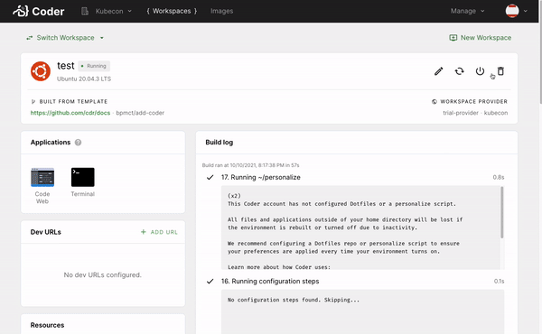

<!-- markdownlint-disable MD041 -->

# Using Coder to edit the Coder docs

With sandbox.coder.com:

[](https://sandbox.coder.com/wac/build?project_oauth_service=github&template_oauth_service=github&template_ref=bpmct%2Fadd-coder&template_url=https://github.com/cdr/docs)

Your own deployment:

```text
New workspace > Create from template

Add image: bencdr/coder:latest (DockerHub)
Repo url: https://github.com/cdr/docs
Branch: bpmct/add-coder
```

Enable the "Workspace applications" feature preview for the best experience:



---

## In this folder

- [coder.yaml](./config.yaml): Coder
  [workspace template](https://coder.com/docs/coder/latest/workspaces/workspace-templates)
  with image, workspace size, etc
- [Dockerfile](./Dockerfile): Image with config & dependencies for editing the
  docs
- [apps/](./apps/): Custom applications for the workspace
- [extensions/](./apps/): VS Code extension files for code-server

## TODO

- [ ] Before merging: edit Open in Coder link and instructions to point to main
      branch
- [ ] Add DockerHub credentials to GitHub actions, change image in template
- [ ] Add to root README
- [ ] Look into other IDEs or editors for markdown
