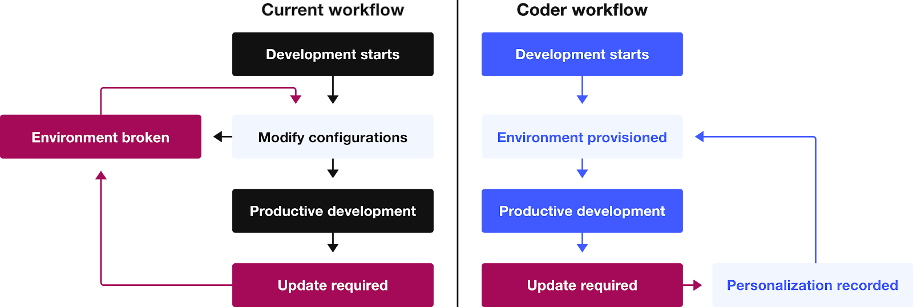
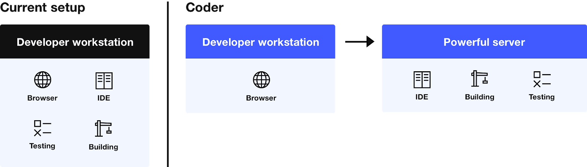
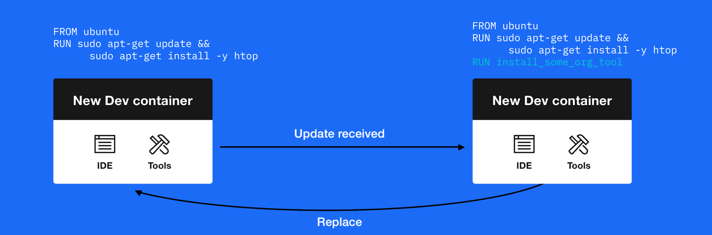
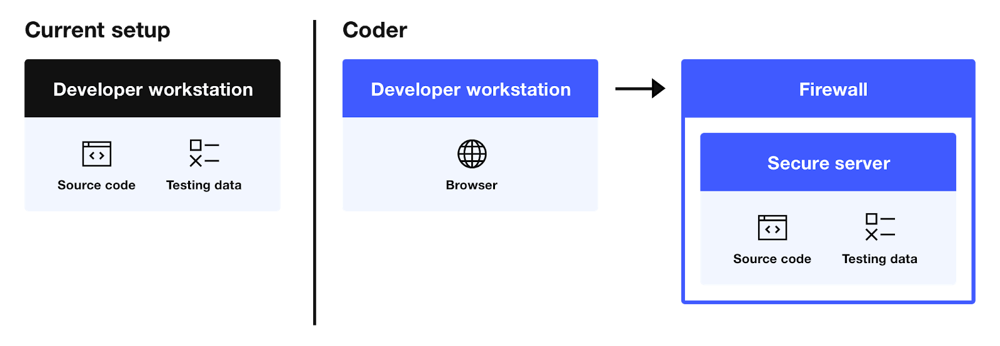

Coder moves software development to the cloud, centralizing your organizations'
development initiatives and offering improvements in development velocity and
enterprise security.

Coder's pre-configured environments allow project organization members to define
what language version and tooling are required to provide consistency across the
organization and allow new members to onboard and contribute. Developers focus
on their projects and the end product, not on setup.

These pre-configured environments are the foundation of Coder's _Dev
Environments as Code_ paradigm, allowing a project's language and tooling
dependencies to be source controlled along with the code itself.

With Coder, engineers can continue using the development tools, CI/CD pipelines,
source code management systems, and editors they know and love while leveraging
the power of cloud and automation.

## Our Mission

Developers should spend their time writing code, not on getting their
development environment working. Coder's goal is to empower organizations to
harness the cloud's power to provide consistent, secure, and performant
environments for their development teams.

Our software has been pulled over 19 million times from Docker, received over
40,000 stars on GitHub, and is used by some of the world's largest enterprises.
We're also working with pilot organizations to shape the future of remote
development through Coder.

## Why Coder

Coder's _Dev Environments as Code_ paradigm is new for software development. Its
key benefits include:

- **Automated Setup and Instant Onboarding**: Because your environments are
  created via pre-configured images, there's little setup time involved for your
  developers. New developers can begin contributing right away instead of
  spending time setting up their working environment.

  

- **Environmental Consistency**: Every component of your environments are
  predefined and preapproved, reducing configuration drift caused by variations
  in development environments. The images used to create environments can also
  be source-controlled the way that your code is.

- **Performant Environments**: Coder empowers you to use servers over local
  hardware to perform resource-intensive development operations. Developers are,
  therefore, not limited to the compute power of the device on which they're
  working or the slow network uploads of large files. All processes are
  performed on the cluster, with only the commands sent over the network.

  

- **Zero Overhead**: Coder performs all graphical rendering on the client,
  minimizing network traffic and resulting in zero overhead for most
  environments. This reduces things like typing lag -- Coder enables remote
  access with the performance of a local environment.

- **Simple Updates**: As soon as you push updates to your organization's base
  development image, developers receive notifications in the dashboard that
  there's an update available. Your developers can upgrade when convenient, and
  you can track which versions your developers are using, providing visibility
  into environmental consistency.

  

- **Centralized Source Code**: Keeping source code centralized on company
  servers mitigates the risk of loss or theft. Developers can work on their
  projects from anywhere while using any device with an internet browser.

  

- **Improved Security**: Development actions are centralized on your internal
  infrastructure, allowing insight into potential threats. Furthermore,
  deploying Coder into an air-gapped environment will provide additional
  security around your organization's intellectual property.
