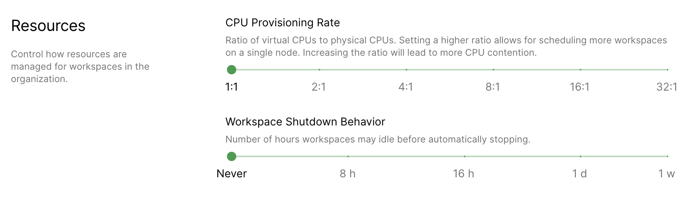

Organizations are groups that tie together users, environments, and images. All
of your images and environments must be assigned to a specific organization. An
end-user can only access images that are assigned to the same organization they
are.

## The Default Organization

When you first set up Coder, you'll generate the default organization. You can
then assign users and their environments to that organization.

There must always be a default organization, but you can change the one set as
the default once you have two or more organizations.

## Organization Roles

Like [User Roles](user-roles.md), members of an organization can be assigned
different roles. There are two roles available:

<table>
    <thead>
        <tr>
            <td><b>Role</b></td>
            <td><b>Description</b></td>
        </tr>
    </thead>
    <tbody>
        <tr>
            <td><b>Organization Manager</b></td>
            <td>Grants full administrative access to the organization and the
            ability to manage its <b>images</b>,<b>services</b>, and
            <b>members</b>. Can view, modify, and delete <b>environments</b>
            belonging to members of the organization.</td>
        </tr>
        <tr>
            <td><b>Organization Member</b></td>
            <td>Grants basic organization access. Can use and view <b>images</b>
            and <b>services</b> belonging to the organization. Can create new
            <b>images</b> assigned to the organization. Can only access
            <b>environments</b> within their organization.</td>
        </tr>
    </tbody>
</table>

Please note that roles are defined per organization. Therefore, assigning
someone as an Organization Manager does not change their role in another
organization.

### Organization Admin Permissions

<table>
    <thead>
        <tr>
            <th></th>
            <th>Create</th>
            <th>Read (all)</th>
            <th>Read (own)</th>
            <th>List</th>
            <th>Delete (all)</th>
            <th>Delete (own)</th>
            <th>Update (all)</th>
            <th>Update (own)</th>
        </tr>
    </thead>
    <tbody>
        <tr>
            <td>Dev URLs</td>
            <td></td>
            <td>X</td>
            <td></td>
            <td></td>
            <td></td>
            <td></td>
            <td></td>
            <td></td>
        </tr>
        <tr>
            <td>Environments</td>
            <td>X</td>
            <td>X</td>
            <td></td>
            <td></td>
            <td>X</td>
            <td>X</td>
            <td>X</td>
            <td>X</td>
        </tr>
        <tr>
            <td>Images</td>
            <td>X</td>
            <td>X</td>
            <td></td>
            <td></td>
            <td>X</td>
            <td></td>
            <td>X</td>
            <td></td>
        </tr>
        <tr>
            <td>Image Tags</td>
            <td>X</td>
            <td>X</td>
            <td></td>
            <td></td>
            <td>X</td>
            <td></td>
            <td>X</td>
            <td></td>
        </tr>
        <tr>
            <td>Metrics</td>
            <td></td>
            <td>X</td>
            <td>X</td>
            <td></td>
            <td></td>
            <td></td>
            <td></td>
            <td></td>
        </tr>
        <tr>
            <td>Org Members</td>
            <td>X</td>
            <td>X</td>
            <td></td>
            <td>X</td>
            <td>X</td>
            <td></td>
            <td>X</td>
            <td></td>
        </tr>
        <tr>
            <td>Orgs</td>
            <td></td>
            <td>X</td>
            <td></td>
            <td>X</td>
            <td></td>
            <td></td>
            <td></td>
            <td></td>
        </tr>
        <tr>
            <td>Registries</td>
            <td>X</td>
            <td>X</td>
            <td></td>
            <td></td>
            <td>X</td>
            <td></td>
            <td>X</td>
            <td></td>
        </tr>
        <tr>
            <td>Services</td>
            <td>X</td>
            <td>X</td>
            <td></td>
            <td></td>
            <td>X</td>
            <td></td>
            <td>X</td>
            <td></td>
        </tr>
        <tr>
            <td>System Banners</td>
            <td></td>
            <td>X</td>
            <td></td>
            <td></td>
            <td></td>
            <td></td>
            <td></td>
            <td></td>
        </tr>
        <tr>
            <td>Users</td>
            <td></td>
            <td>X</td>
            <td>X</td>
            <td></td>
            <td></td>
            <td></td>
            <td></td>
            <td></td>
        </tr>
    </tbody>
</table>

### Organization Member Permissions

<table>
    <thead>
        <tr>
            <th></th>
            <th>Create</th>
            <th>Read (all)</th>
            <th>Read (own)</th>
            <th>List</th>
            <th>Delete (all)</th>
            <th>Delete (own)</th>
            <th>Update (all)</th>
            <th>Update (own)</th>
        </tr>
    </thead>
    <tbody>
        <tr>
            <td>Dev URLs</td>
            <td></td>
            <td>X</td>
            <td></td>
            <td></td>
            <td></td>
            <td></td>
            <td></td>
            <td></td>
        </tr>
        <tr>
            <td>Environments</td>
            <td>X</td>
            <td>X</td>
            <td></td>
            <td></td>
            <td></td>
            <td>X</td>
            <td></td>
            <td>X</td>
        </tr>
        <tr>
            <td>Images</td>
            <td>X</td>
            <td>X</td>
            <td></td>
            <td></td>
            <td></td>
            <td></td>
            <td></td>
            <td></td>
        </tr>
        <tr>
            <td>Image Tags</td>
            <td>X</td>
            <td>X</td>
            <td></td>
            <td></td>
            <td></td>
            <td></td>
            <td></td>
            <td></td>
        </tr>
        <tr>
            <td>Metrics</td>
            <td></td>
            <td></td>
            <td>X</td>
            <td></td>
            <td></td>
            <td></td>
            <td></td>
            <td></td>
        </tr>
        <tr>
            <td>Org Members</td>
            <td></td>
            <td></td>
            <td></td>
            <td>X</td>
            <td></td>
            <td></td>
            <td></td>
            <td></td>
        </tr>
        <tr>
            <td>Orgs</td>
            <td></td>
            <td></td>
            <td></td>
            <td>X</td>
            <td></td>
            <td></td>
            <td></td>
            <td></td>
        </tr>
        <tr>
            <td>Registries</td>
            <td></td>
            <td>X</td>
            <td></td>
            <td></td>
            <td></td>
            <td></td>
            <td></td>
            <td></td>
        </tr>
        <tr>
            <td>Services</td>
            <td></td>
            <td>X</td>
            <td></td>
            <td></td>
            <td></td>
            <td></td>
            <td></td>
            <td></td>
        </tr>
        <tr>
            <td>System Banners</td>
            <td></td>
            <td>X</td>
            <td></td>
            <td></td>
            <td></td>
            <td></td>
            <td></td>
            <td></td>
        </tr>
        <tr>
            <td>Users</td>
            <td></td>
            <td></td>
            <td>X</td>
            <td></td>
            <td></td>
            <td></td>
            <td></td>
            <td></td>
        </tr>
    </tbody>
</table>

## Namespaces

Coder's helm chart includes `namespaceWhitelist`. This value takes a list of the
namespaces that are in your cluster and are available to Coder. If you don't set
`namespaceWhitelist`, the only available namespace is the one Coder has deployed
to (this is also the default namespace).

If you're a site manager, you can assign a namespace to an organization; all
resources for that organization now reside in that namespace. **Please note that
this field is not editable once set.**

