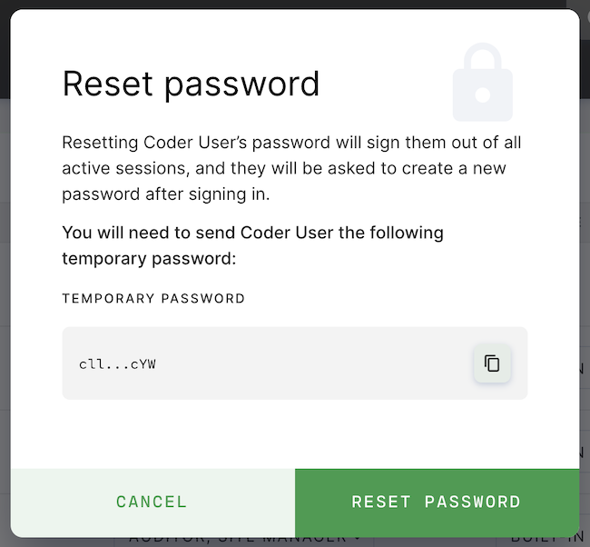

To reset a user's password:

1. Go to **Manage** > **Users**.
1. Find the user whose password you want to reset and click the vertical
   ellipses to the right.
1. Click **Reset password**. Coder will display a temporary password that you
   can provide to the user. Click **Reset Password** to proceed with the reset.



When the user logs in using the temporary password, Coder will prompt them to
change it.

> You can only reset passwords for users using **built-in authentication**.

## Resetting the Site Admin Password

If you need to reset the password for a Site Admin, you can do so using
cemanager's **reset-admin-password** command.

> You should have the
> [kubectl](https://kubernetes.io/docs/tasks/tools/install-kubectl/) dependency
> installed from when you first set up Coder; if not, please sure to install it
> before proceeding.

To reset the password, run the following in the terminal:

```console
# get any cemanager pod
kubectl get pods | grep cemanager- | awk '{print $1}' | head -n1

# call the reset-admin-password subcommand
kubectl exec -it <cemanager pod> -- cemanager reset-admin-password
```

You'll be presented with a temporary password for the **Site Admin** user; the
next time the Site Admin logs in with this set of credentials, Coder will prompt
them to change the password.
