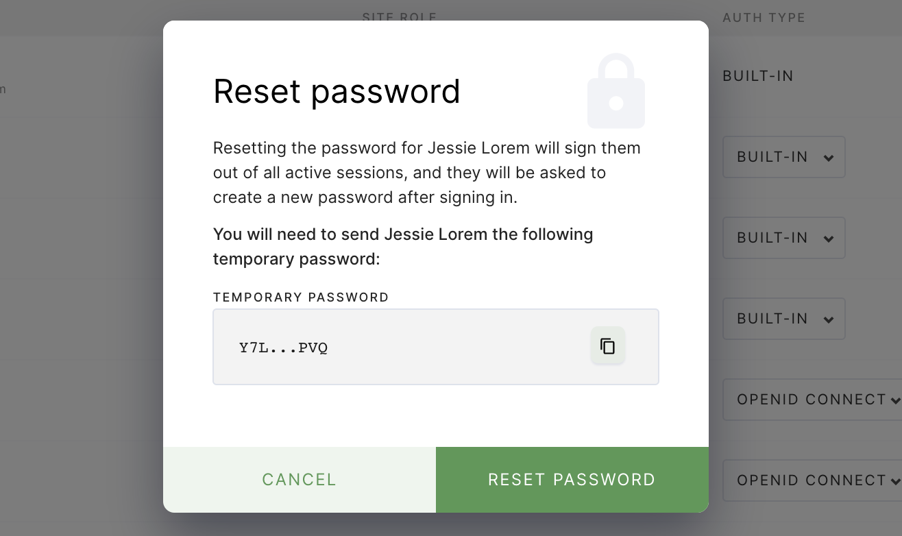

This article walks you through resetting a user password, as well as resetting a
site admin's password.

## Resetting a user password

To reset a non-site admin's password:

1. Log into Coder as a site manager, and go to **Manage** > **Users**.
1. Find the user whose password you want to reset and click the vertical
   ellipsis to the right.
1. Click **Reset password**. Coder will display a temporary password that you
   can provide to the user. Click **Reset Password** to proceed with the reset.



When the user logs in using the temporary password, Coder will prompt them to
change it.

> You can only reset passwords for users using **built-in authentication** using
> the Coder UI.

## Resetting the site admin password

If you need to reset the password for a site admin, you can do so using
`coderd`'s **reset-admin-password** command.

> This process requires the
> [kubectl](https://kubernetes.io/docs/tasks/tools/install-kubectl/) dependency,
> which should have been installed when you first set up Coder; if not, please
> sure to install it before proceeding.
>
> If you are using Docker, follow
> [these instructions](../../../setup/coder-for-docker/local.md#admin-password)
> instead.

To reset the site admin password, run the following in the terminal:

```console
# point to the coder namespace
kubectl config set-context --current --namespace=coder

# get any coderd pod
kubectl get pods | grep coderd- | awk '{print $1}' | head -n1

# call the reset-admin-password subcommand
kubectl exec -it <coderd pod> -- coderd reset-admin-password

# alternatively, you can combine the two commands above into one line
kubectl exec -it $(kubectl get pods | grep coderd- | awk '{print $1}' | head -n1) -- coderd reset-admin-password
```

Coder will present you with a temporary password for the site admin user; the
next time the site admin logs in with this set of credentials, Coder will prompt
them to change the password.
