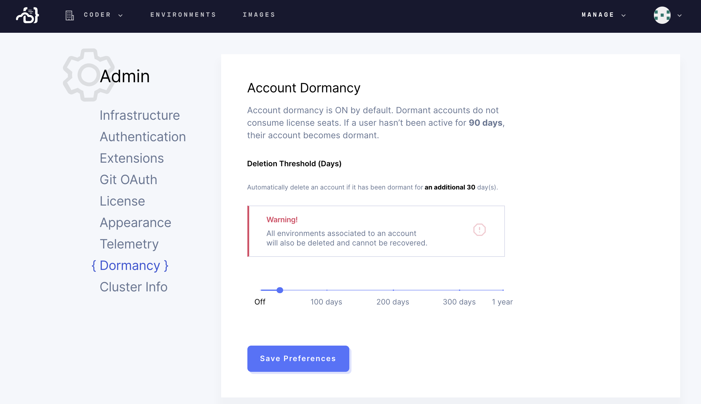

Coder's account dormancy feature allows you to free up license seats if you
have users that aren't active on the platform for 90 days or more.

You can choose to automatically delete a dormant account after a period of time.
For example, you can set Coder to delete accounts 30 days after they go
dormant (this means that the user has been inactive for 120 days: 90 days to
become dormant, plus an additional 30 days).

