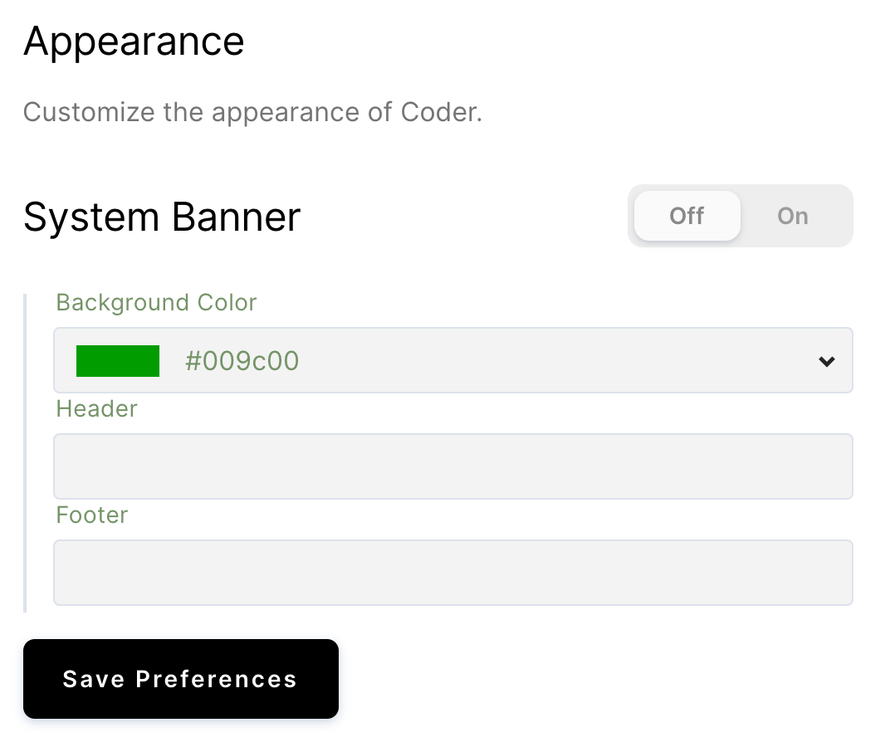
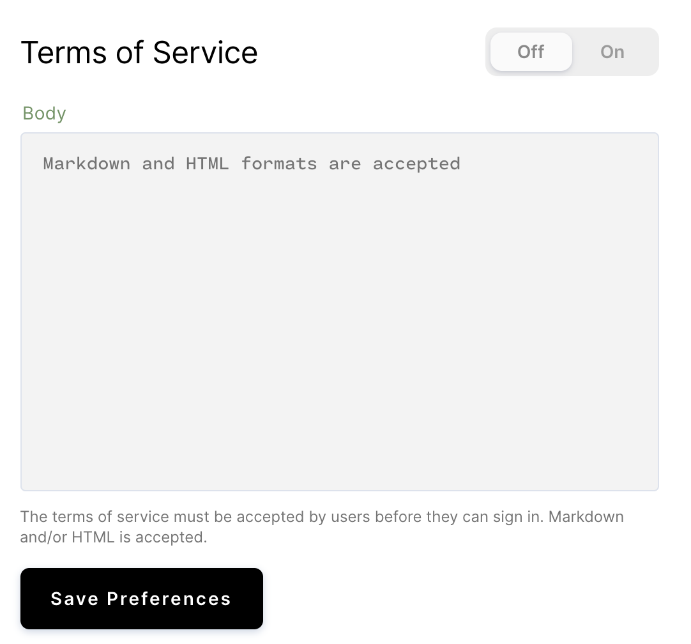

Coder offers you appearance customization options for the following:

- System banner messages
- The Terms of Service display

## System Banner Messages

To customize your system banner messages:

1. Go to **Manage** > **Admin** > **Appearance** in the Coder UI.
2. Select the checkbox next to **Enabled**.
3. Set your **background color**, and provide the text you want to be displayed
   in your **Header** and **Footer**.
4. Click **Save Preferences** to save your changes.

## Terms of Service

To enable the display of a Terms of Service and to edit the text displayed:

1. Go to **Manage** > **Admin** > **Appearance** in the Coder UI.
2. Select the checkbox next to **Enabled**.
3. Provide your Terms of Service in **Body**; this editor accepts HTML and
   Markdown formatting.
4. Click **Save Preferences** to save your changes.

**Note**: If you enable the use of a Terms of Service, users will not be able to
log into Coder without first accepting the Terms of Service.
