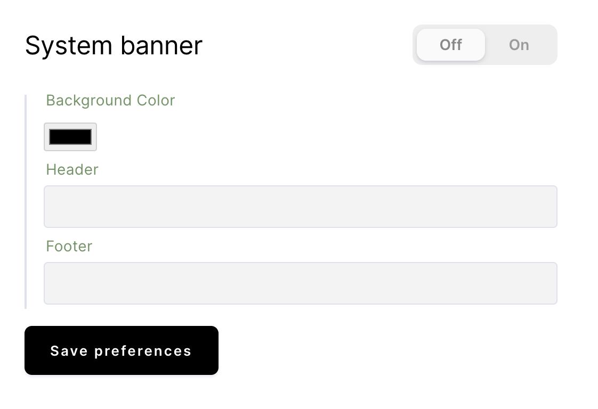
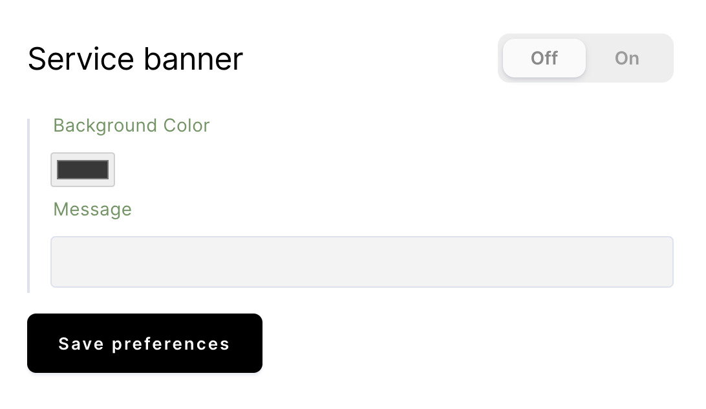

Coder offers you appearance customization options for the following:

- System banner messages
- Service banner messages
- The terms of service display

## System banners

To customize your system banner messages:

1. Go to **Manage** > **Admin** > **Appearance** in the Coder UI.
1. Toggle the **System Banner** switch to **On**.
1. Set your **Background Color**, and provide the text you want to be displayed
   in your **Header** and **Footer**.
1. Click **Save Preferences** to save your changes.

## Service banners

The service banner allows you to display a message to all users of your Coder
system. The user can dismiss the message at any time and Coder will not display
a banner until you change the message (or disable and re-enable the current
message).

1. Go to **Manage** > **Admin** > **Appearance** in the Coder UI.
1. Toggle the **Service Banner** switch to **On**.
1. Set the **Message**.
1. Click **Save Preferences**.

## Terms of service

To enable the display of terms of service and to edit the text displayed:

1. Go to **Manage** > **Admin** > **Appearance** in the Coder UI.
1. Toggle the switch to **On**.
1. Provide your Terms of Service in **Body**; this editor accepts HTML and
   Markdown formatting.
1. Click **Save Preferences** to save your changes.

**Note**: If you enable the use of terms of service, users will not be able to
log in to Coder without first accepting the terms of service.
