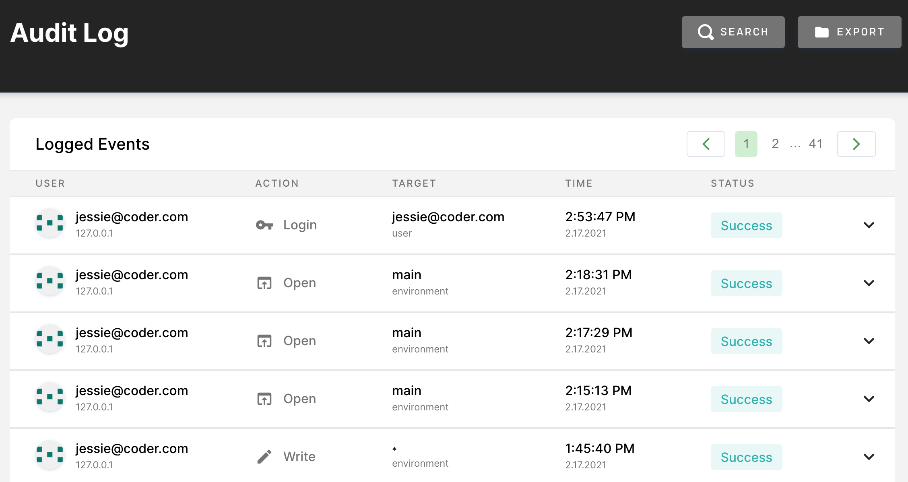

Coder maintains records of all user actions on system resources for auditing
purposes.

Any user who is a **Site Manager** or an **Auditor** can log into Coder, go to
**Manage** > **Audit**, and view the **Audit Logs**.

By default, this page displays a chronological list of all actions taken on the
system.

You can filter the logs displayed using the search filters available at the top:

- **Resource Type**: The resource on which the action is taken (e.g., image,
  workspace, user)
- **Action**: The action that the user took against a resource (e.g., read,
  write, create)
- **Resource Target**: The friendly name for the resource (e.g., the user with
  the email address **dev@coder.com**)
- **User**: The user who performs the action
