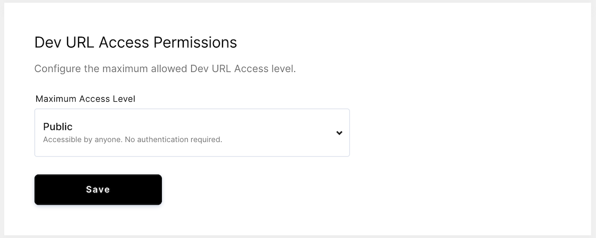

Developer (Dev) URLs allow users to access the ports of services they develop
within their workspace. However, before individual developers can set up dev
URLs, an administrator must configure and enable dev URL usage.

## Before you proceed

You must own a wildcard DNS record for your custom domain name to enable and use
dev URLs with Coder.

## Enabling the use of dev URLs

[Dev URLs](../workspaces/devurls.md) is an opt-in feature. To enable dev URLs in
your cluster, you'll need to modify your:

1. Helm chart
1. Wildcard DNS record

### Step 1: Modify the Helm chart

Set `devurls.host` to a wildcard domain pointing to your ingress controller:

```shell
helm upgrade coder coder/coder --set devurls.host="*.my-custom-domain.io"
```

If you're using the default ingress controller, specifying a value for
`devurls.host` automatically adds a rule that routes dev URL requests to the
user's workspace:

```yaml
 - host: "*.my-custom-domain.io"
    http:
      paths:
      - path: /
        backend:
          serviceName: envproxy
          servicePort: 8080
```

If you are providing an ingress controller, then you will need to add the rule
manually.

### Step 2: Modify the wildcard DNS record

The final step to enabling dev URLs is to update your wildcard DNS record. Get
the **ingress IP address** using `kubectl --namespace coder get ingress` and
point your wildcard DNS record (e.g., \*.my-custom-domain.io) to the ingress IP
address.

## Setting dev URL access permissions

Once you've enabled dev URLs for users, you can set the **maximum access
level**. To do so, go to **Manage** > **Admin**. On the **Infrastructure** tab,
scroll down to **Dev URL Access Permissions**.

<table>
  <tr>
    <th>Maximum access level</th>
    <th>Description</th>
  </tr>
  <tr>
    <th>Public</th>
    <td>Accessible by anyone (no authentication required) with access to the network your cluster is on</td>
  </tr>
  <tr>
    <th>Authenticated</th>
    <td>Accessible by any authenticated Coder user</td>
  </tr>
  <tr>
    <th>Organization</th>
    <td>Accessible by anyone in the user's organization</td>
  </tr>
  <tr>
    <th>Private</th>
    <td>Accessible only by the user</td>
  </tr>
</table>



You can set the maximum access level, but developers may choose to restrict
access further.

For example, if you set the maximum access level as
**Authenticated**, then any dev URLs created for workspaces in your Coder
deployment will be accessible to any authenticated Coder user.

The developer, however, can choose to set a stricter permission level (e.g.,
allowing only those in their organization to use the dev URL). Developers cannot
choose a more permissive option.
