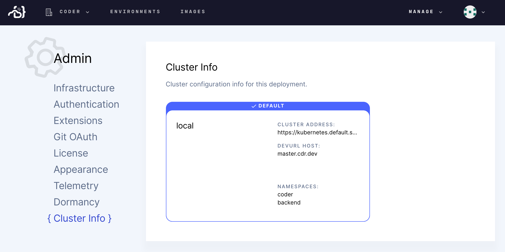

The **Cluster Info** page, available via **Manage** > **Admin** > **Cluster
Info** allows you to see cluster information for your deployment, including:

- The cluster address
- The Dev URL host
- The namespaces available

