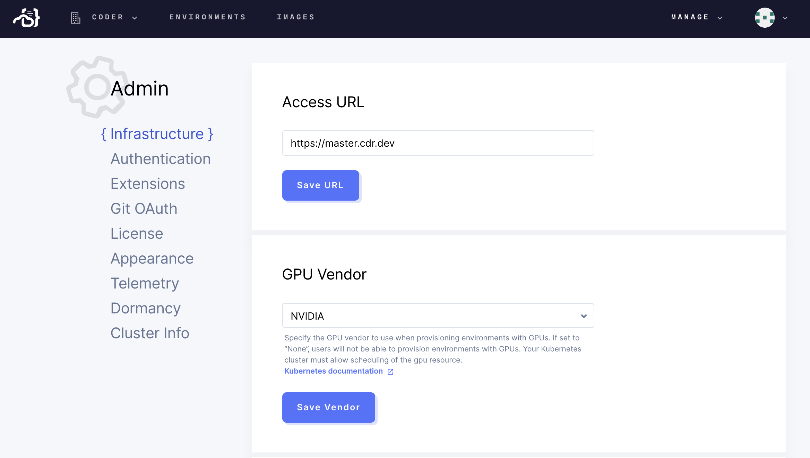

GPUs can be used for performing tasks such as machine learning within
environments.

By default, users cannot create environments with GPUs until a site manager
configures and enables this feature.

### Step 1: Configure Your Kubernetes Cluster

<a href="https://kubernetes.io/docs/tasks/manage-gpus/scheduling-gpus/"
target="_blank" rel="noreferrer noopener">Configure</a> your Kubernetes cluster
with the available GPUs and all necessary device plugins and drivers.

### Step 2: Enable GPU Vendor in Coder

Go to **Manage** > **Admin**. On the **Infrastructure** tab, find the **GPU
Vendor** setting, and change it to the GPU vendor of choice (either **AMD** or
**Nvidia**). Click **Save Vendor**.

