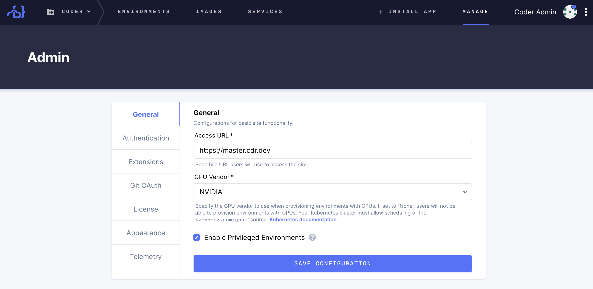

Privileged environments are those that can be deployed with a sidecar running
Docker Daemon. If you install the Docker Client CLI in a privileged environment,
the environment can interact with the Docker Daemon.

> Though privileged environments offer certain conveniences to a user's
> workflow, they can be exploited by malicious users and therefore present a
> security risk.

You may choose to enable **privileged environments** (by default, newly created
environments lack this privilege).

