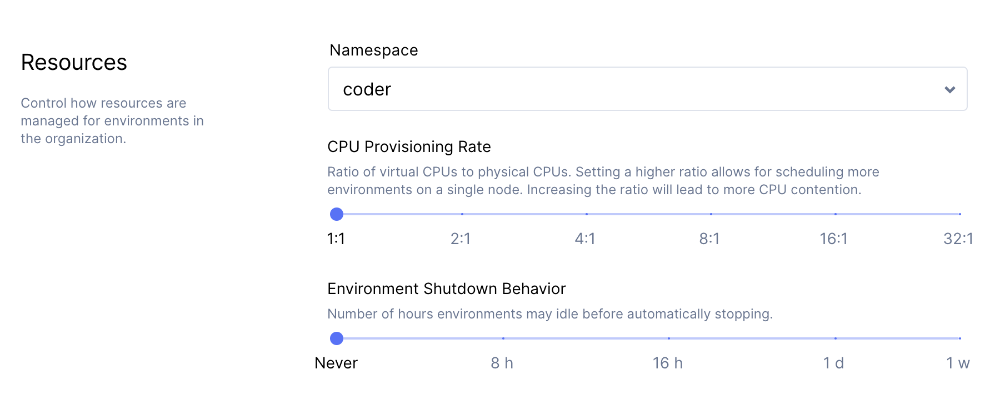

You can specify the duration of inactivity allowed before an environment
automatically shuts down. This helps you optimize your resource allocation since
automatically shutting down idle environments can save resource availability and
reduce costs.

> An environment that's stopped must be rebuilt before it can be used again. All
> data outside of **/home** is lost during rebuild. Please store any changes you
> would like persisted across rebuilds with the
> [Dotfiles](../../environments/personalization.md) feature.

## Configuring Environment Shutdown Behavior

If you have administrative privileges, you can configure the environment
shutdown behavior. Configuring the environment shutdown behavior is done at the
organization level.

In the Coder dashboard, go to **Manage** > **Organizations** and choose the
organization you'd like to modify.

Click **Edit** in the top-right. In the dialog that opens, use the slider
underneath **Environment Shutdown Behavior** to select the maximum allowed
duration.

