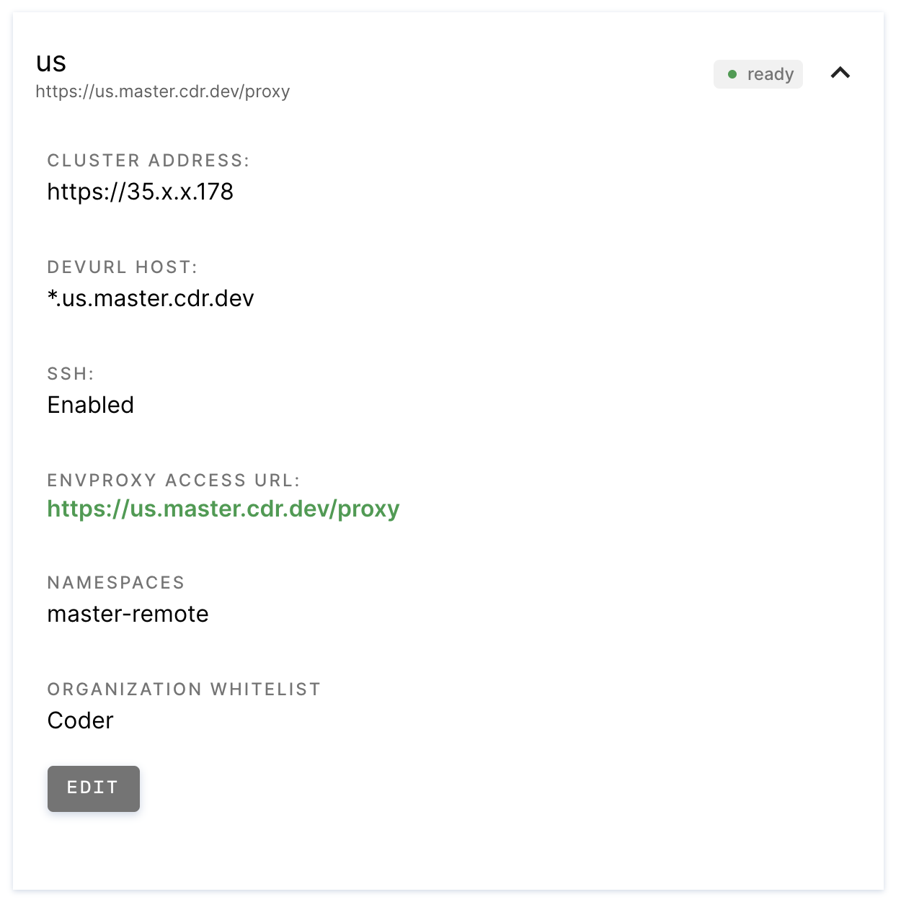

Workspace Providers are logical groups of resources developers can deploy workspaces onto.
Workspace Providers enable a single Coder deployment to provision and manage workspaces 
across multiple Kubernetes clusters and namespaces, including ones located in other 
geographies, regions, or clouds. 

Distributed teams can use this feature to allow users to manage workspaces in
the cluster that's nearest, reducing network latency and improving developers'
experience. Additionally, you can use workspace providers to support data
sovereignty requirements or increase the isolation between workspaces running in
the same region or cluster.

### Built-In Workspace Provider

By default, all Coder deployments will have a `built-in` Workspace Provider that identifies
the kubernetes cluster the Coder deployment is in. This enables workspaces to be deployed
into the same cluster as the Coder deployment with no additional actions required.

### Remote Workspace Providers

A Workspace Provider can be deployed into any existing kubernetes cluster, and will enable
that cluster to become a selectable pool of resources developers can create workspaces in.
Remote Workspace Providers can provide lower latency to developers by locating their
workspaces closer to them geographically, or can be used for workload isolation purposes. 
See [Deploying A Workspace Provider](../../guides/deploying-workspace-provider.md) 
to learn how you can expand your Coder deployment to additional kubernetes clusters.

## Admin UI

Site managers and admins can view the workspace providers configuration page
available via **Manage** > **Admin** > **Workspace Providers**.

The Admin panel shows an overview of all configured workspace providers and
indicates their statuses and details. The **default** tag indicates the provider
initially selected when a user creates an environment using the Create an
Environment dialog.

You can expand individual listings to view in-depth information:

### Statuses

A Workspace Provider can have one of the following statuses:
- Pending: The Workspace Provider has been registered, but has not yet been 
  successfully deployed into the remote kubernetes cluster.
- Ready: The Workspace Provider is online, available, and new workspaces can be
  provisioned into it.
- Error: The Workspace Provider encountered an issue on startup or cannot be reached
  by the Coder deployment. An error message will be provided in the Workspace Provider's details.

### Organization Allowlists

A Site Admin can manage which organizations have permissions to provision new
workspaces in each Workspace Provider. When a new organization is created it 
is allowed to provision into the `built-in` workspace provider by default.
Organizations must not contain any environments in the workspace provider prior
to being removed from that workspace provider's allowlist.

### Workspace Provider Lifecycle

Creation and deletion of workspace providers is done via the Coder CLI. Any
configuration changes to the details of the Workspace Provider are applied
via Helm when the Workspace Provider is deployed and updated. For more information
see [Deploying A Workspace Provider](../../guides/deploying-workspace-provider.md).