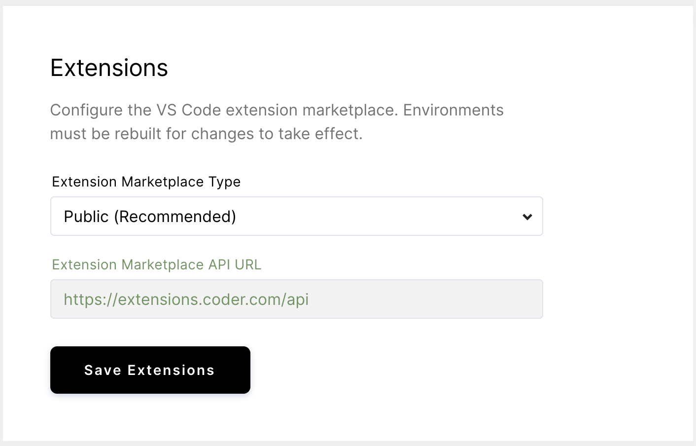

You can customize VS Code with extensions, which allow you to add new features
and functionality (e.g., languages, debuggers, tools), themes, and more.

## The Extension Marketplace

You can find the extensions available to you in the Extension Marketplace.
Access to the marketplace is enabled by default and requires no unique
configuration on your part. You can, however, choose between two types of
extensions marketplaces by going to **Admin** > **Instrastructure**, then
scrolling down to **Extensions**:

- **Public**: a Coder-hosted marketplace of open-source VS Code extensions
- **Custom**: your organization's custom VS Code extension marketplace API,
  accessed via the URL you provide

## Air-Gapped Marketplaces

If you run Coder in an air-gapped environment, the public VS Code marketplace is
inaccessible to end-users. Using the **Custom** configuration option, your can
point your Coder instance to an air-gapped instance of
[OpenVSX](https://github.com/eclipse/openvsx) to serve assets to users.

View the OpenVSX deployment wiki
[here](https://github.com/eclipse/openvsx/wiki/Deploying-Open-VSX).
