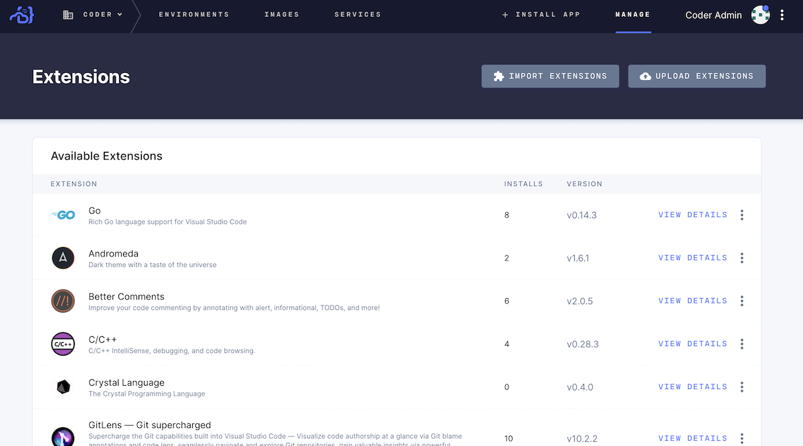

You can customize VS Code with extensions, which allow you to add new features
and functionality (e.g., languages, debuggers, tools), themes, and more.

## The Extension Marketplace

You can find the extensions available to you in the Extension Marketplace.
Access to the marketplace is enabled by default and requires no unique
configuration on your part. You can, however, choose from one of the following
three types of extensions marketplaces by going to **Manage** > **Admin** >
**Extensions**:

- **Public**: a Coder-hosted marketplace of open-source VS Code extensions
- **Custom**: your organization's custom VS Code extension marketplace API,
  accessed via the URL you provide
- **Internal**: VS Code extensions served from within the Coder private network

## Installing an Extension from a Marketplace

Coder users can "install" extensions by navigating to **Manage** >
**Extensions** and selecting **Import Extensions**. Find the extension you want,
either by filtering for it or selecting it in the list displayed. Click
**Import**.

<video autoplay loop="loop" width="100%" controls
src="../assets/import-extension.mp4"></video>

## Coder's Internal Marketplace

If you run Coder in an air-gapped environment, the public VS code marketplace is
inaccessible to end-users.

However, Coder offers an integrated extensions marketplace that allows users to
customize their IDE. The integrated marketplace minimizes the risk of security
concerns typically presented by the public VS Code marketplace by allowing
organizations to select the extensions their developers can use.

### Adding an Extension to the Internal Marketplace

You can add extensions to the internal marketplace by uploading the **.vsix**
bundle. To do so, navigate to **Manage** > **Extensions** and select **Upload
Extensions**. Find and upload the file for your extension.
