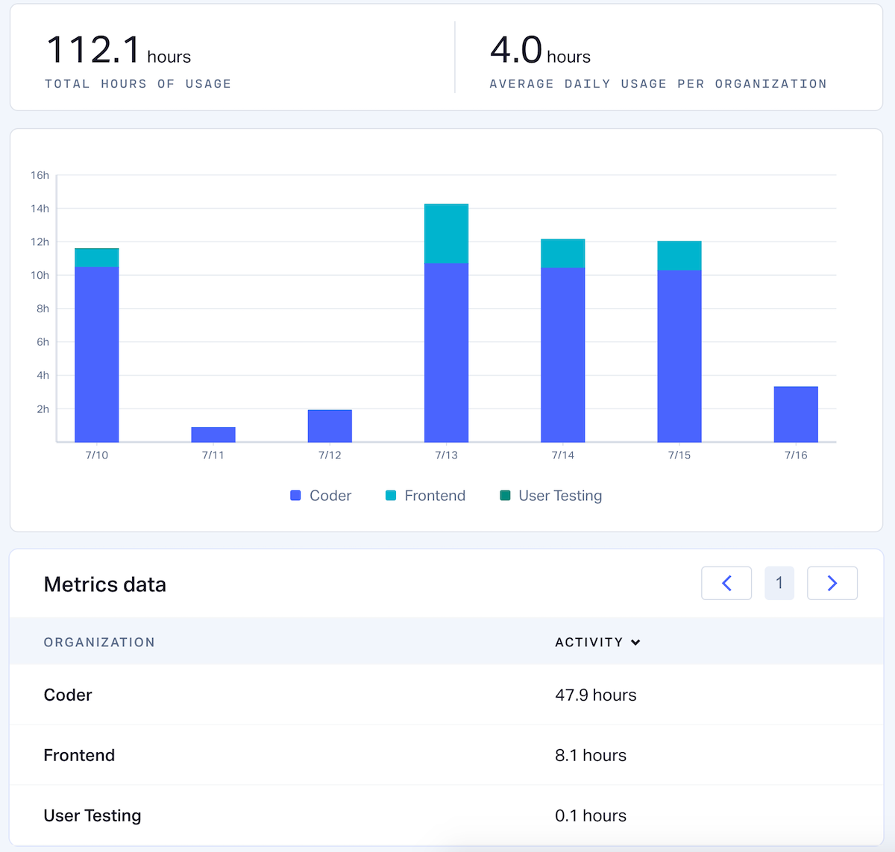

Metrics allow you to track your usage of your Coder Enterprise. You can see
information regarding how you use particular features and how much you use your
individual environments.

## Accessing Metrics

> Users can view their own metrics, while admins can view data for all
> organizations and users.

To see the metrics Coder has collected regarding your use:

1. Click on your username in the top-right corner
2. In the drop-down that appears, select **Personal Metrics**.

## Metrics Views

Coder makes use of three types of displays:

* A summary panel
* A graphical view that displays the data over time
* A data table that displays aggregate data

## Filters

You can change the data displayed using the provided **Filters** on the
right-hand side of the screen. The filters available are:

* **Time range**: Whether you want to display **1 week** or **1 month** of data
* **Group by**: How you want your data is grouped on the charts Coder displays;
  options include **Organization**, **User**, **Environment**, and **Activity
  Source**
* **Organizations**: Whether you want to display data for all organizations or
  just the organizations of your choice
* **Users**: The user(s) whose data you want to be included

You can also choose whether you would like to include or exclude data gathered
on the weekends using the **Exclude weekends** checkbox.
