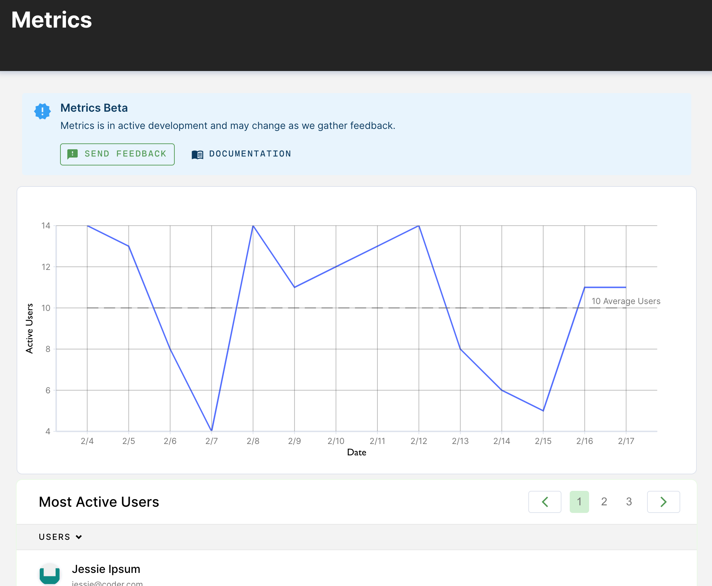

Metrics allow you to track the number of people using Coder on a day-to-day
basis. Access the following view from **Manage > Metrics**.



## Filters

You can filter the report by the following properties:

- **Organization**: Only show user activity within a specific
  [organization](./organizations/)

- **Action**: Only show users who performed a specific action within the time
  period

  - **Any**: Any of the below actions count towards activity

  - **IDE**: Used a web IDE in a workspace (Code Web, JetBrains, PyCharm,
    Jupyter, RStudio)

  - **Login**: Logged in to Coder

  - **App**: Used a custom
    [workspace application](../workspaces/applications.md) in a workspace
    (measures long-lived requests e.g. WebSockets)

  - **Tunnel**: Connected to a workspace over SSH (VS Code Remote, JetBrains
    Gateway) or directly used `coder tunnel`

  - **Web Terminal**: Used a web terminal in a workspace

## Activity API

You can use the REST API to generate reports for specific time periods and
intervals. For example, "active IDE users in August, by week."

```sh
ACCESS_URL=https://coder.example.com
API_ROUTE=api/private
API_KEY=PLACEHOLDER # Use `coder tokens create`

curl --request GET \
  --url "$ACCESS_URL/$API_ROUTE/metrics/activity?\
start=2022-08-01T00:00:00.000000Z&end=2022-08-31T00:00:00.000000Z\
&category=ide\
&interval=1 week" \
--header "Session-Token: $API_KEY"
```

> Filter by organization with `org=id` Other intervals include 1 week, 1 year,
> 90 day

Coder will return a list of active users over the time period as well as how
much time each user spent with the activity (in milliseconds)

```js
{
   // 1 week intervals
    "activity": [
        {
            "time": "2022-08-01T00:00:00Z",
            "duration": 604800000000000,
            "user_activity": [
                {
                    "user_id": "6004ad77-a7a69a24d779dd9f44357014",
                    "duration": 72000000000000, // 20h (in nanoseconds)
                    "count": 1200
                },
                {
                    "user_id": "5f905429-ba6e4ac480eb4c0ead160b47",
                    "duration": 30780000000000, // 8h 33m
                    "count": 513
                },
                {
                    "user_id": "627935e2-838713a0437b43f006b26244",
                    "duration": 2760000000000, // 46m
                    "count": 46
                }
            ]
        },
        // +3 weeks...
    ],
    // All active users from 2022-08-01 -> 2922-08-31
    "users": {
        "6004ad77-a7a69a24d779dd9f44357014": {
            "id": "6004ad77-a7a69a24d779dd9f44357014",
            "name": "Joe",
            "username": "joe2",
            "roles": [
                "site-member",
                "site-manager"
            ],
            "avatar_hash": "671b4b1db753a55396036354ff526c8df02e0a53bb4ce4990010a96ab8782ffd",
            "total_count": 4713,
            "total_duration": 282780000000000 // 78h 36m
        },
        "needs-id": {
            "id": "627935e2-838713a0437b43f006b26244",
            "name": "Bob",
            "username": "bob12",
            "roles": [
                "site-member"
            ],
            "avatar_hash": "51fb9f8ed9f17d919c62055a81db00015662af958edd91e52e14149f64aae434",
            "total_count": 3708,
            "total_duration": 360000000000 // 61h 48m
        }
        "5f905429-ba6e4ac480eb4c0ead160b47": {
            "id": "5f905429-ba6e4ac480eb4c0ead160b47",
            "name": "Alice",
            "username": "alice92",
            "roles": [
                "site-member"
            ],
            "avatar_hash": "970ee9aa01c30411825a1f90208c2ce5cffffda643973260bf10fa35b4a188c4",
            "total_count": 3468,
            "total_duration": 2640000000000  // 57h 48m
        },
    }
}
```
