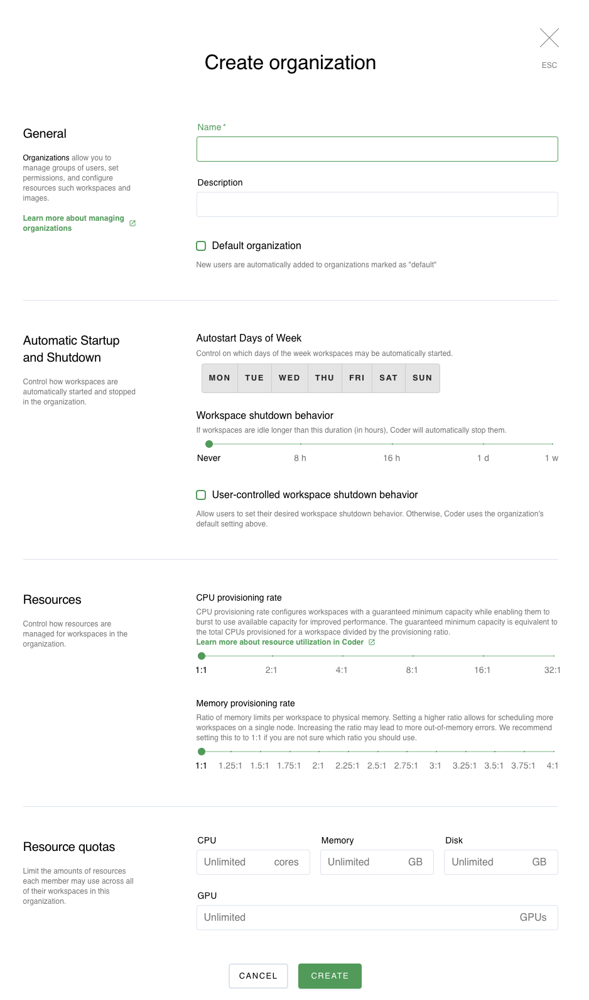
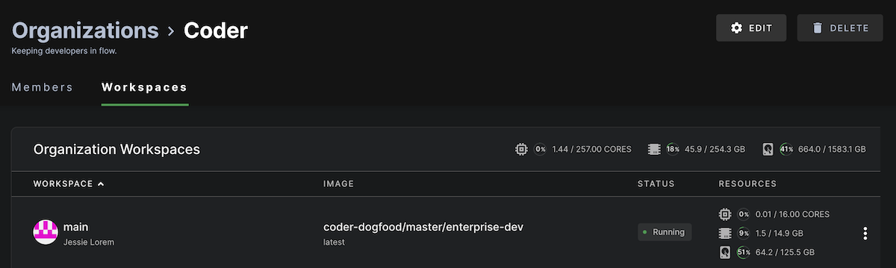
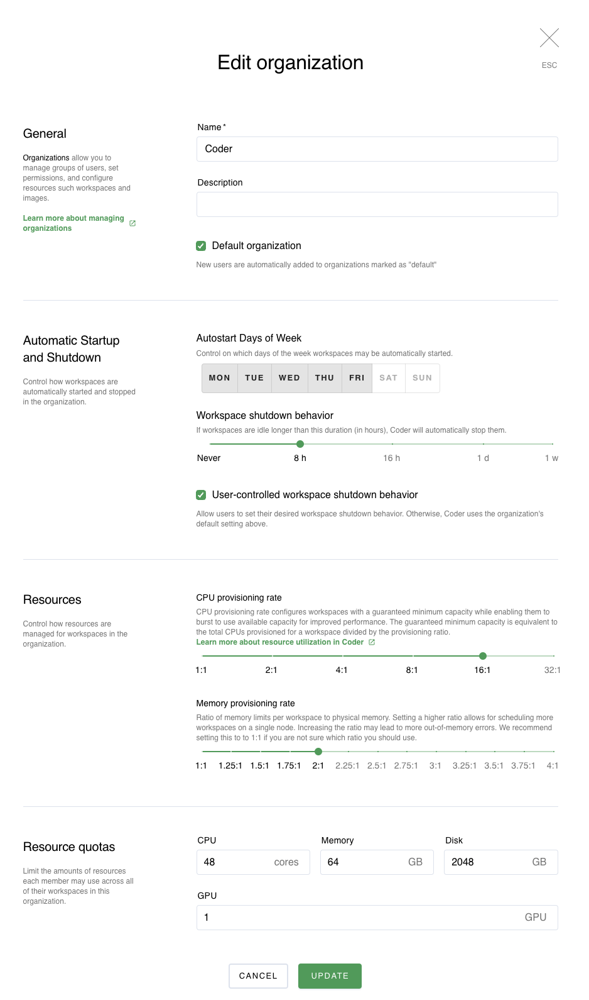

This article shows how you can create, view, edit, or delete an organization.

## Create a new organization

[Site admins and site managers](../access-control/user-roles.md) can create new
organizations by going to **Manage** > **Organizations** > **New Organization**.

Provide a **name** and (optionally) a **description** for this organization. If
you want this to become a **Default organization**, make sure to check the box
for this.

You can also control how Coder manages resources for workspaces in this
organization. You can set the:

- **CPU Provisioning Rate**: sets the ratio of virtual CPUs to physical CPUs; if
  you set a higher ratio, you can schedule a larger number of workspaces per
  node, though it will also lead to greater CPU contention
- **Workspace Shutdown Behavior**: The number of hours a workspace may be idle
  before Coder stops it automatically to help free up resources

Finally, you can set **Resource Quotas**. These are limits on the number of
**CPUs** and **GPUs**, as well as the amount of **memory** and **disk space**,
each developer can request concurrently for running workspaces in this
organization. The limits for what you can set are as follows:

- **CPUs**: 128 CPU cores
- **Memory**: 256 GBs
- **Disk**: 8192 GB
- **GPUs**: 20 GPUs

When you've set your parameters, click **Create** to proceed.

## Viewing an organization

You can view information about an organization at any time by going to
**Manage** > **Organizations** and selecting the org of interest.

The **Members** tab displays users that belong to the org. The **Workspaces**
tab displays the workspaces that belong to the org, as well as the resources
they consume.

## Editing an organization

You can edit an organization at any time by going to **Manage** >
**Organizations**.

Find the organization you want to edit, and click to open. In the top-right,
click **Edit** to launch the **Edit Organizations** dialog.

When you're finished making your changes, click **Update** to save.

## Deleting an organization

You can edit an organization at any time by going to **Manage** >
**Organizations**. Find the organization that you want to delete, and click to
open. In the top right, click **Delete**. Confirm that you would like to delete
the org.

> Deleting an organization does not delete users or workspaces. Coder reassigns
> existing users and workspaces to a default org.
