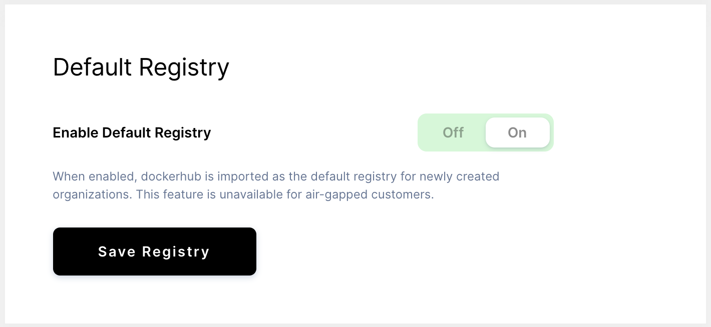

> This feature is unavailable for air-gapped deployments.

Coder is configured to automatically import the default
[registry](index.md), Docker Hub, to streamline your initial setup
process.

This means that your users can create environments using Docker Hub images
without further configuration on your part.

## Disable the Importing of the Default Registry

If you prefer a more granular experience, you can disable the importing of
Docker Hub. You'll then have to manually configure registries on a
per-organization basis before you can import images that can be used to create
new environments.

To do so:

1. Launch the Coder dashboard.
2. Go to **Manage** > **Admin**.
3. On the **Infrastructure** tab, uncheck the Import Default Registry option.
4. Click **Save Registry**.

