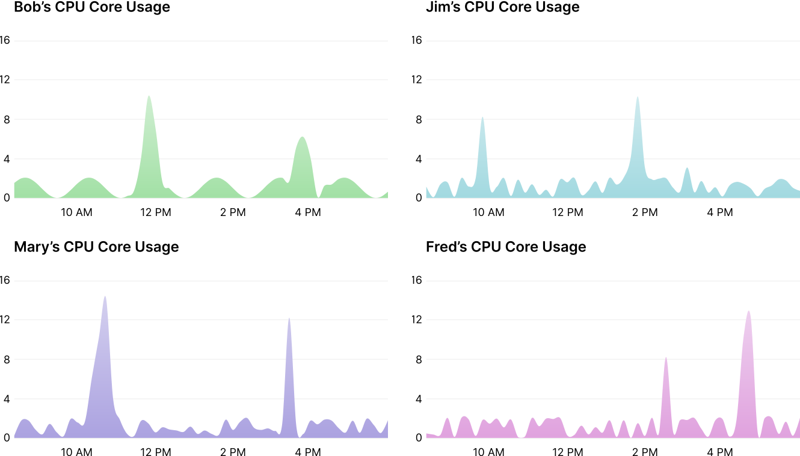
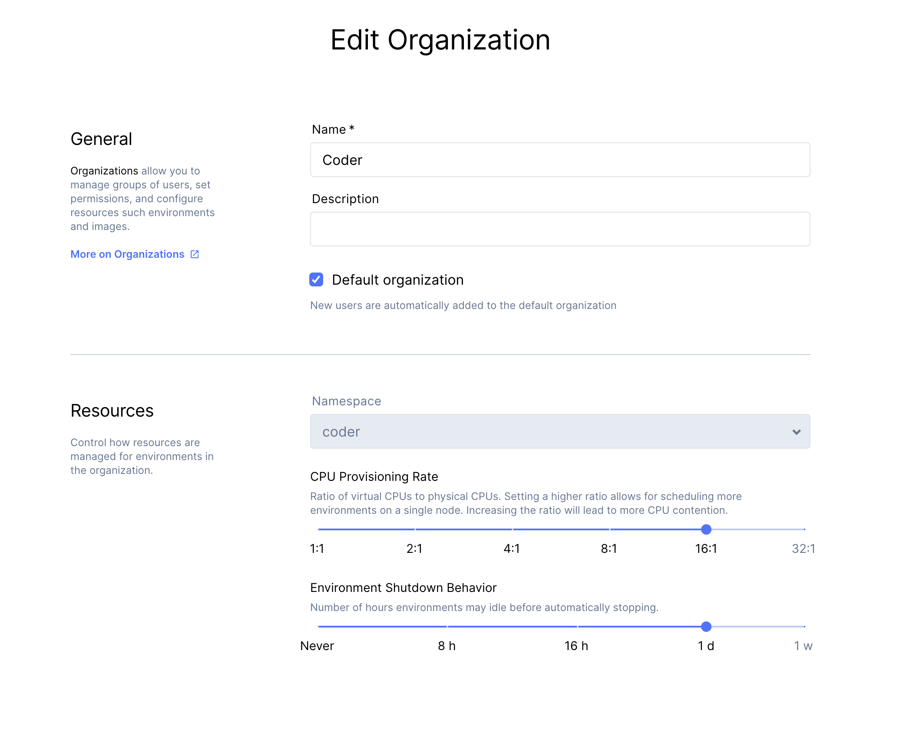

## Overview

Developer computing workloads are unique in that they don’t require consistent
access to CPU, instead they have **short periods of peak usage** during builds and
compilations, followed by **long periods of relative idling**.

Build and compilation performance directly impacts the development
experience of a project– faster builds mean faster iteration cycles,
leading to greater development velocity. But, traditional approaches to
providing developers with more hardware for computationally intensive
compilations leads to wasted resources and sunk costs.  

### With Expensive Laptops / Desktops

Consider the case where a project's compilation is parallelizable up to 16 CPU
cores. To provide a more tolerable build time, each developer is given a 16
CPU core laptop. During builds, the machine sees 100% utilization. But, notice
that the machine is underutilized a vast majority of a typical workday.
Only during the few minutes of compilation are the resources
utilized.

### Shared Resources With Coder Workspaces on Your Cloud Infrastructure

This behavior enables a model of **Shared Resources** to provide developers access
to greater computing resources at similar or lower costs to your organization.
Consider the prior example. Instead, let’s place each developer into their own
isolated Coder Workspace, all scheduled onto the same piece of hardware.
Suppose this hardware is a 16 CPU core machine. Notice how each developer
has access to the proper resources during peak load– providing a
performant experience when needed, with less waste during periods of idling.

<!-- Notice how each developer has access to greater
resources during peak load– providing a superior experience when needed,
with less waste when not. -->

**What happens during resource contention?**

If resources on the underlying node become contented, CPU cycles are shared
on a weighted basis relative to the resource request of the Coder Workspace.
But, the nature of developer workflows makes resource contention far less
common than in other server workloads, given that it only occurs when several
users are simultaneously performing an infrequent compilation task.

## Configuring Shared Resources in Coder

There are 5 primary variables that determine how resource allocation and usage
will effect developers and compute costs.

- Kubernetes Node type (virtual CPU count and memory size)
- Coder Workspace default CPU and memory limits
- Coder Organization CPU and memory provision-ratio
- The magnitude and frequency of code compilation operations
- Coder Organization Workspace inactivity shutdown threshold

