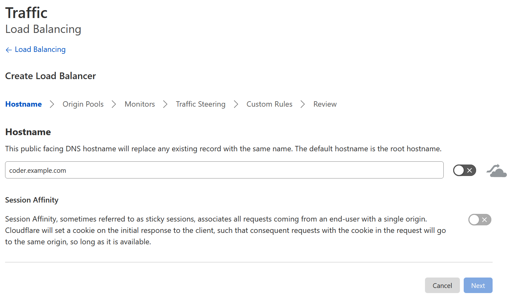
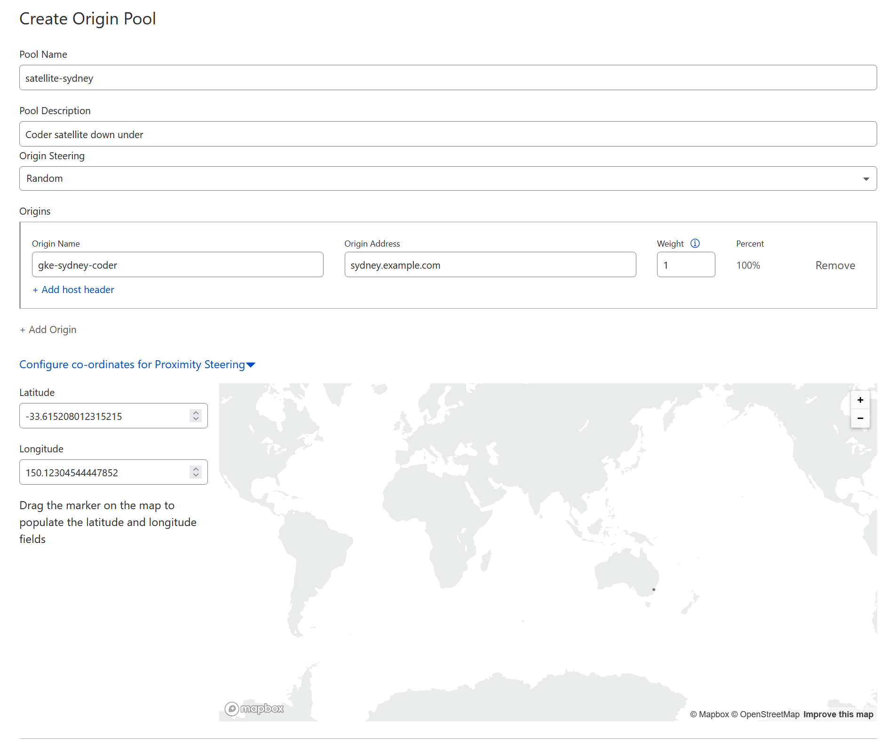
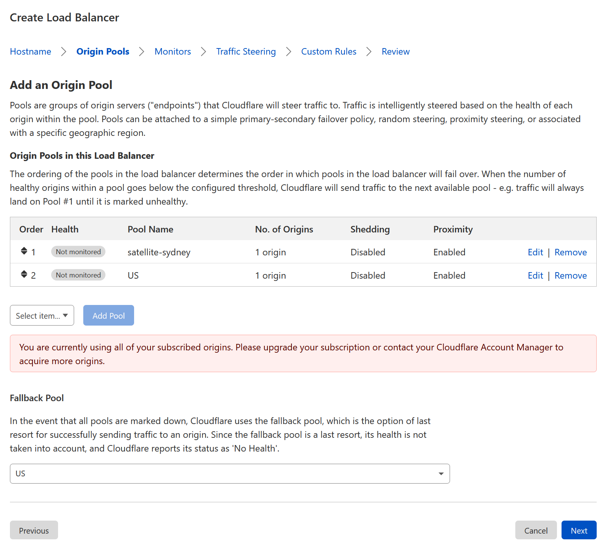

By default, the primary deployment and satellite deployments have different
access URLs. Using two access URLs can confuse engineering teams when it comes
time to determine which one they should use for Coder.

To prevent confusion, Coder supports an optional unified hostname configuration
where the primary deployment and all satellite deployments share a hostname. All
users who access Coder use the same URL; meanwhile, your DNS server or anycast
configuration ensures that users are still accessing a deployment that is near
to them geographically, offering low latency when connecting to their
workspaces.

GeoDNS (also known as _geographical split-horizon DNS_) is a DNS load balancing
technique that helps users connect to their geographically nearest servers
without relying on anycast IP routing. This guide will focus on GeoDNS setup,
though it will still work with anycast routing.

## Requirements

You will need the following:

- A primary access URL (e.g. `https://primary.example.com`)
- One or more satellite access URLs (e.g. `https://sydney.example.com`,
  `https://london.example.com`)
- A "unified" access URL (e.g. `https://coder.example.com`). If you are using
  GeoDNS, you should set the default backend to the primary access URL. Set the
  backend for each region with a satellite to the corresponding satellite access
  URL or IP address
- A TLS certificate for the primary deployment that has both the primary
  hostname and the corresponding unified hostname
- A TLS certificate for _each_ satellite with the satellite's hostname and the
  corresponding unified hostname

> Please note that:
>
> - If you are using cert-manager, you can add hostnames to a certificate by
>   including them in the `spec.dnsNames` section.
> - We recommend maintaining a separate "regional" hostname or IP address for
>   each primary or satellite so you can access them explicitly to aid in
>   debugging. This guide will walk you through preserving the existing regional
>   access URL.

## Configure a unified access URL on Coder

1. Configure your geo DNS or anycast routing so the primary Coder deployment and
   all satellites share a single hostname, as well as their individual
   hostnames. (We have provided instructions on
   [how to create a GeoDNS load balancer on Cloudflare](#create-a-geodns-load-balancer-on-cloudflare)
   below.)

1. In the primary Helm values file, set `coderd.alternateHostnames` to your
   primary hostname and unified hostname:

   ```yaml
   coderd:
     alternateHostnames:
       - "primary.example.com"
       - "coder.example.com"
   ```

1. In _each_ of your satellite deployments' Helm values file:

   1. Set `coderd.satellite.accessURL` to your unified access URL (this value
      will be used as the default URL).

   1. Set `coderd.alternateHostnames` to your satellite's specific hostname and
      your unified hostname:

      ```yaml
      coderd:
        alternateHostnames:
          - "satellite.example.com"
          - "coder.example.com"
      ```

1. Redeploy your primary and satellite deployments with your new Helm values.

1. Once you've fully deployed your primary and satellite deployments, log into
   Coder on your original primary access URL and go to **Manage** > **Admin**.

1. On the **Infrastructure** tab, set the **Access URL** field to your unified
   access URL (e.g. `https://coder.example.com`).

1. If you've enabled logins via OIDC, log into your OIDC identity provider's
   admin page and update Coder's redirect URI to reflect your new access URL
   (e.g. `https://coder.example.com/oidc/callback`).

1. If you've enabled Git account linking, log into each Git provider and update
   Coder's redirect URI to reflect your new access URL.

At this point, all users should be able to access Coder via the unified access
URL. Your DNS server will automatically route users to their nearest
geographical primary or satellite deployment for low latency. OIDC logins should
work as expected across all domain names, including the primary access URL.

## Create a geo DNS load balancer on Cloudflare

To create a geo DNS load balancer on Cloudflare:

1. Log in to Cloudflare, and select the domain on which you want your geo DNS
   hostname to exist.

1. Expand the **Traffic** app on the sidebar and select **Load Balancing**.

1. Enable **Load Balancing** if you haven't already.

1. Ensure that your Cloudflare plan has enough origin servers for your
   deployments; you will need one origin server for the primary deployment and
   one for each satellite deployment.

1. Click **Create Load Balancer**.

1. Enter the unified hostname you wish to use (e.g. `coder.example.com`).

   

1. **Optional:** Disable Cloudflare proxying by **unchecking** the orange cloud.
   We recommend disabling Cloudflare proxying when using satellites, since
   proxying adds additional hops that will increase latency.

1. Click **Next** to proceed.

1. For the primary deployment and _each_ satellite deployment, do the following
   steps:

   1. Click **+ Create an Origin Pool**.

   1. Set the **Pool Name** and **Pool Description**.

   1. Specify a single origin with **Origin Address** set to the hostname or IP
      address of the deployment. Then, set the **Weight** to **1**.

   1. Click **Configure co-ordinates for Proximity Steering** and drag the
      marker to roughly where the deployment is located geographically.

   1. Click **Save**.

   

1. Once you have completed the above steps for the primary and each satellite
   deployment, ensure that all origin pools have been assigned to the load
   balancer.

1. Set the **Fallback Pool** to your primary deployment's origin pool.

   

1. Click **Next** until you reach the **Traffic Steering** step.

1. Set the traffic steering policy to **Proximity steering**.

1. Click **Next** until you reach the **Review** step.

1. Review your changes; then, click **Save and Deploy**.
