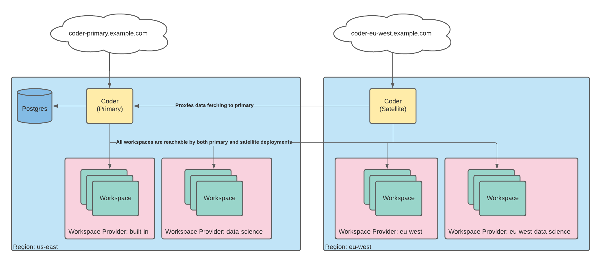

# Satellites

Workspace providers allow a single Coder deployment to provision and manage
workspaces across multiple Kubernetes clusters and namespaces, including those
located in other geographies, regions, or clouds.

Satellites are Coder deployments that are used as access points to workspaces
provisioned in a multi-region pattern. Satellites reduce latency for developers
by acting as local proxies to the workspaces, keeping traffic from the
developer's machine to the workspaces within the same region instead of
requiring the traffic to cross regions back to the primary Coder deployment.

Satellites act as a secure reverse proxy to both Coder workspaces and the
primary Coder deployment. Traffic meant for workspaces, such as web and SSH
connections, are sent directly to the workspaces, while all other traffic is
routed to the primary Coder deployment.

Coder users connect to the satellite deployment that's geographically closest to
them instead of to the primary deployment, gaining the benefits of local
proxying.
