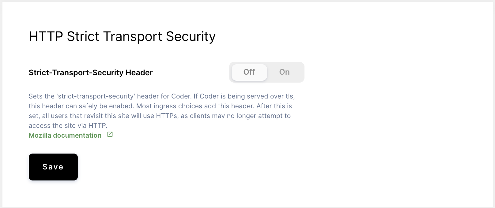
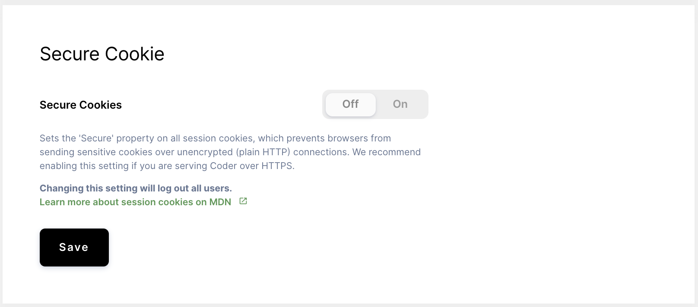

Coder offers two browser security features that you can choose to enable. These
are available under **Manage** > **Admin** > **Infrastructure**.

## HTTP Strict Transport Security

Enabling **HTTP Strict Transport Security** sets [the
`strict-transport-security`
header](https://developer.mozilla.org/en-US/docs/Web/HTTP/Headers/Strict-Transport-Security)
for Coder. If you are serving Coder over HTTPS, we recommend enabling HTTP
Strict Transport Security, which requests that browsers and clients use HTTPS
for all connections (many ingress controllers automatically add this header for
connections served over HTTPS). After you set this header, all users revisiting
the site will use HTTPS, since clients may no longer access the site via HTTP.

## Secure Cookie

Enabling **Secure Cookie** sets the `secure` property on all [session
cookies](https://developer.mozilla.org/en-US/docs/Web/HTTP/Cookies), preventing
browsers from sending sensitive cookies over unencrypted (HTTP) connections. We
recommend enabling this setting if you are serving Coder over HTTPS.

