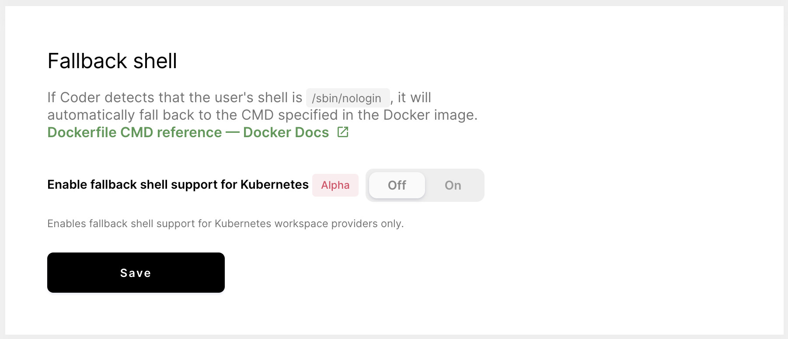

You can enable fallback shell support so that Coder will automatically fall back
to the
[CMD specified in the Docker image](https://docs.docker.com/engine/reference/builder/#cmd)
if Coder detects that the user's shell is `/sbin/nologin`.

To enable fallback shell support for Kubernetes:

1. Log in to Coder as a site manager.
1. Go to Manage > Admin.
1. On the **Infrastructure** tab, find the **Fallback shell** section.
1. Toggle **Enable Fallback Shell support for Kubernetes** to **On**.

