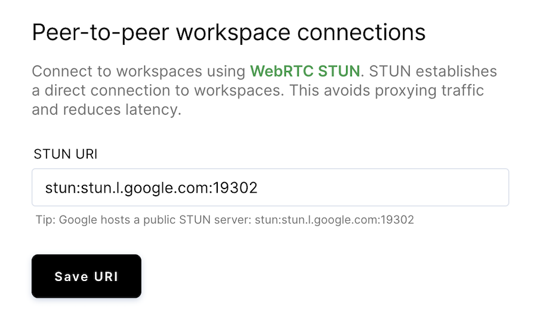

Coder supports the use of [WebRTC STUN](https://en.wikipedia.org/wiki/STUN),
enabling direct (P2P) connections to workspaces. Direct connections to
workspaces help avoid the need to proxy traffic, reducing latency.

To connect to workspaces using WebRTC STUN:

1. In the Coder UI, go to **Manage** > **Admin** > **Infrastructure**.
1. Scroll down to **Peer-to-peer workspace connections**, and provide the **STUN
   URI**.
