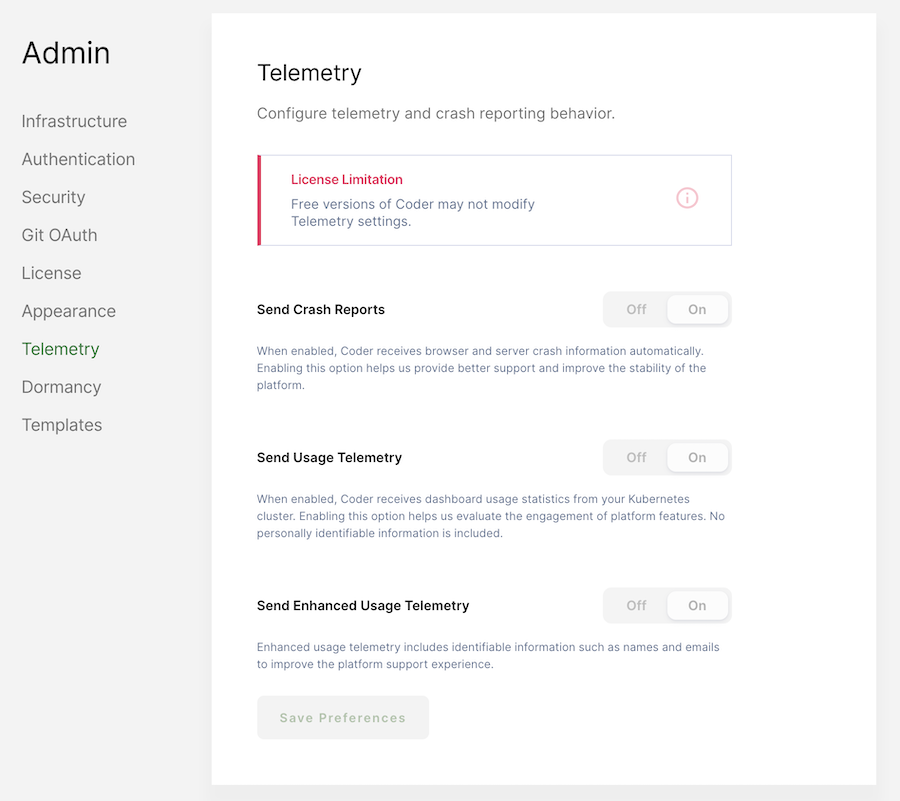

# Telemetry

Coder allows you to control the behavior of its built-in telemetry and crash
reporting features.

In the Coder UI, go to **Manage** > **Admin** > **Telemetry**.

Using the provided checkboxes, indicate whether you want Coder to **Send Crash
Reports**, **Send Usage Telemetry**, or **Send Enhanced Usage Telemetry**.

Be sure to click **Save Preferences** after you make your changes.

> You cannot modify the default telemetry settings during a
> [free trial](https://coder.com/trial) of Coder or by those with evaluation
> deployments.
