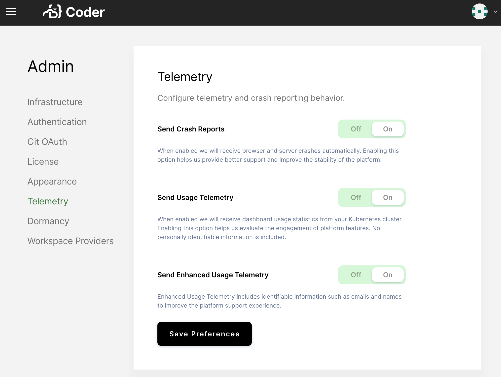

Coder Enterprise allows you to control the behavior of its built-in telemetry
and crash reporting features.

In the Coder UI, go to **Manage** > **Admin** > **Telemetry**.

Using the provided checkboxes, indicate whether you want Coder Enterprise to
**Send Crash Reports** and/or **Send Usage Telemetry**.

Be sure to click **Update Telemetry** after you make your changes.

> Coder for Free users and those with evaluation deployments cannot modify the
> default telemetry settings.
