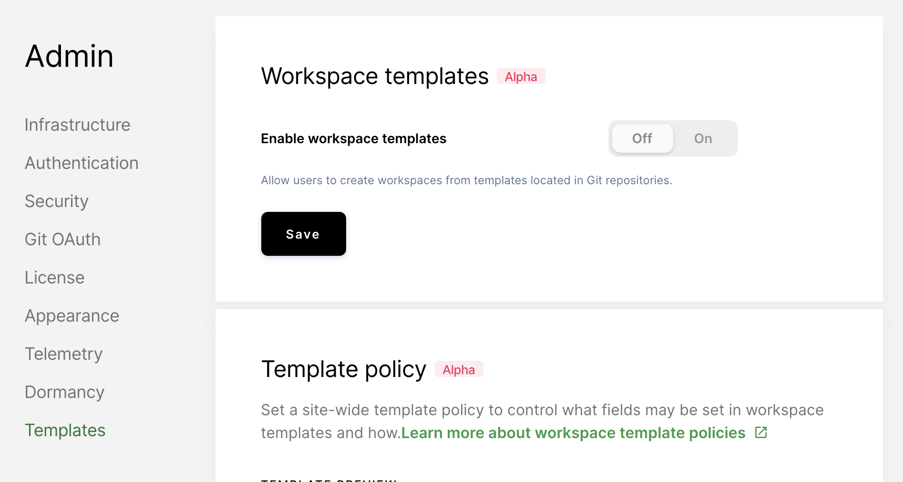

The **Templates** tab features a form you can use for generating an embeddable
button. This button makes it easy for developers to use your
[workspace template](../workspaces/workspaces-as-code/index.md).

To create your button:

1. Go to **Manage** > **Admin** > **Templates**.
1. Fill out the fields.

Once you've filled out the form, Coder generates a custom Markdown snippet,
which you can then add to your repository's `README.md`.

## Enabling workspaces as code

By default, workspaces as code is an opt-in feature. To enable workspaces as
code, go to **Admin > Templates** and set **Enable using Workspace Templates**
to **On**.

