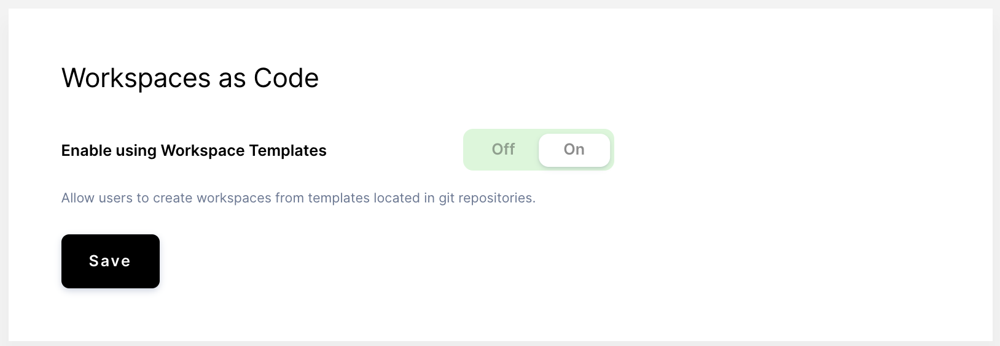

The **Templates** tab features options that control the behavior of workspace
templates.

The **Enable using Workspace Templates** toggle allows you to enable or disable
the creation of [workspaces](../workspaces/index.md) using predefined templates
located in Git repositories.



## Template policy (alpha)

If you enable the use of workspace templates, a **template policy** allows you
to control which fields users can set and which values can be used when they
define their workspaces.

The following policies can be applied to fields:

```text
read: workspaces cannot modify the field
write: workspaces can overrite the field
append: lists only, workspaces can append items to the field (e.g configure.start steps)
```

The default template policy is as follows:

```yaml
version: "0.2"
workspace:
  configure:
    start:
      policy: write
  dev-urls:
    policy: write
  specs:
    kubernetes:
      container-based-vm:
        policy: write
      cpu:
        policy: write
      disk:
        policy: write
      env:
        policy: write
      gpu-count:
        policy: write
      image:
        policy: write
      labels:
        policy: read
      memory:
        policy: write
      node-selector:
        policy: read
      tolerations:
        policy: read
```

Underneath the policy template preview, you can either upload your policy or you
can drag-and-drop the file onto the UI. Click **Save** to persist your changes.

If, at any time, you want to remove your policy and use Coder's default policy,
click **Reset to default**.

The template policy applies to all workspaces created and managed in Coder,
including custom workspaces. If properties of a workspace conflict with the
template policy, those values in the workspace will be ignored.

## Embeddable Button

The Embeddable Button section features a form you can use for generating an
embeddable button. This button makes it easy for developers to use your
[workspace template](../workspaces/workspaces-as-code/index.md).

To create your button:

1. Go to **Manage** > **Admin** > **Templates**.
1. Fill out the fields.

Once you've filled out the form, Coder generates a custom Markdown snippet,
which you can then add to your repository's `README.md`.


## Enabling workspaces as code

By default, workspaces as code is an opt-in feature. To enable workspaces as
code, go to **Admin > Templates** and set **Enable using Workspace Templates**
to **On**.


