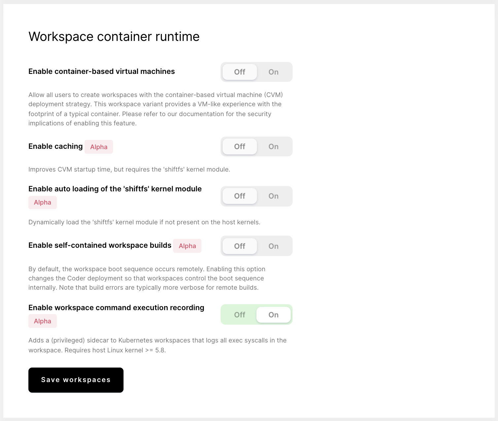

The command execution recording feature allows you to log all system-level
processes executing in the workspace. Enabling this feature adds a privileged
sidecar to your workspaces for this purpose -- you can view the output from the
sidecar or send it to a monitoring stack, such as CloudWatch, for further
analysis.

Please note that these logs are not recorded or captured by the Coder
organization in any way, shape, or form.

## Requirements

Use of the command execution recording functionality requires a host Linux
kernel >= 5.8.

## Enable command execution recording

To enable command execution recording:

1. Log into Coder as a site manager.
1. Go to **Manage** > **Admin**.
1. On the **Infrastructure** page, scroll down to the **Workspace container
   runtime** section.
1. Toggle on **Enable workspace command execution recording**.
1. Click **Save workspaces**.

