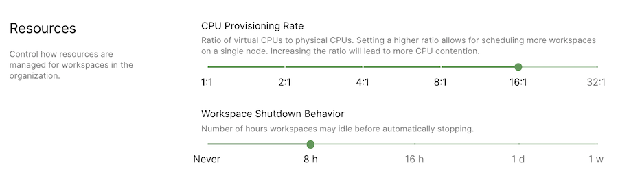

Coder allows you to set the CPU provisioning ratio for each of your
organizations. The CPU provisioning ratio configures workspaces with a
guaranteed minimum capacity, while enabling them to use available capacity for
improved performance. The guaranteed minimum capacity is equivalent to the total
CPUs provisioned for a workspace divided by the provisioning ratio.

For example, let's say that you set a CPU provisioning ratio of 8:1. If a user
creates a workspace with 4 CPUs, then Coder will reserve 0.5 CPUs on the
underlying node, with a maximum limit of 4 CPUs.

[Learn more about how resource utilization in Coder works](https://coder.com/docs/coder/v1.20/guides/admin/resources#individual-vs-shared-resources)

## Changing the CPU provisioning ratio

1. Go to **Manage** > **Organizations** and select your organization.
1. At the top of your organization page, click **Actions** > **Edit**. Scroll
   down to **CPU Provisioning Rate** and set the maximum ratio.
1. Click **Update**.

