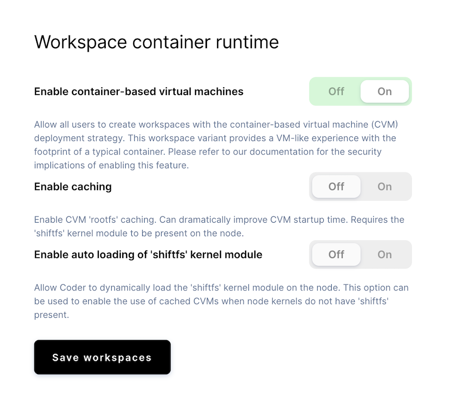

If you're a site admin or a site manager, you can enable
[container-based virtual machines (CVMs)](../../workspaces/cvms.md) as a
workspace deployment option. CVMs allow users to run system-level programs, such
as Docker and systemd, in their workspaces.

## Infrastructure requirements

- CVMs leverage the
  [Sysbox container runtime](https://github.com/nestybox/sysbox), so the
  Kubernetes Node must run a supported Linux distro with the minimum kernel
  version (see
  [Sysbox distro compatibility](https://github.com/nestybox/sysbox/blob/master/docs/distro-compat.md)
  for more information)
- The cluster must allow privileged containers and `hostPath` mounts. Read more
  about why this is still secure [here](#security).

> You can use any cloud provider that supports the above requirements, but we
> have instructions on how to set up supported clusters on
> [AWS](../../setup/kubernetes/aws.md) and
> [Google](../../setup/kubernetes/google.md). Azure-hosted clusters will meet
> these requirements as long as you use Kubernetes version 1.18+.
>
> Coder doesn't support legacy versions of cluster-wide proxy services such as
> Istio, and CVMs do not currently support NFS as a file system.

### GPUs

NVIDIA GPUs can be added to CVMs on bare metal clusters only. This feature is
not supported on Google Kubernetes Engine or other cloud providers at this time.

Support for NVIDIA [GPUs](gpu-acceleration.md) is in **beta**. We do not support
AMD GPUs at this time.

## Enabling CVMs in Coder

1. Go to **Manage > Admin > Infrastructure**.
1. Toggle the **Enable Container-Based Virtual Machines** option to **Enable**.

### Enabling cached CVMs

> Cached CVMs are currently an **alpha** feature.

To improve the startup time for CVM-based workspaces, you can enable caching.

Cached CVMs require the `shiftfs` kernel to be present on the node. Some
distributions (such as Ubuntu) include `shiftfs`. If you're unsure if `shiftfs`
is present on your nodes, you can check by running `modinfo shiftfs`. If no
output is returned, then you do not have `shiftfs` installed.

If you don't want to install `shiftfs` yourself, you can have Coder install the
module automatically for you. **It is important that you do not have secure boot
enabled and that you have the kernel headers installed if you want Coder to
install `shiftfs` on your behalf.**

> GPUs are not supported with cached CVMs at this time.



## Setting up your cluster

The following sections show how you can set up your K8 clusters hosted by
Google, Azure, and Amazon to support CVMs.

### Google Cloud Platform w/ GKE

To use CVMs with GKE, [create a cluster](../../setup/kubernetes/google.md) using
the following parameters:

- GKE Master version `latest`
- `node-version = "latest"`
- `image-type = "UBUNTU"`

For example:

```console
gcloud beta container clusters create "YOUR_NEW_CLUSTER" \
    --node-version "latest" \
    --cluster-version "latest" \
    --image-type "UBUNTU"
    ...
```

### Azure Kubernetes Service

If you're using Kubernetes version 1.18, Azure defaults to the correct Ubuntu
node base image. When creating your cluster, set `--kubernetes-version` to
`1.18.x` or newer for CVMs.

### Amazon Web Services w/ EKS

You can modify an existing [AWS-hosted container](../../setup/kubernetes/aws.md)
to support CVMs by
[creating a nodegroup](https://eksctl.io/usage/managing-nodegroups/#creating-a-nodegroup-from-a-config-file)
and updating your `eksctl` config spec.

1. Define your config file in the location of your choice (we've named the file
   `coder-node.yaml`, but you can call it whatever you'd like):

   ```yaml
   apiVersion: eksctl.io/v1alpha5
   kind: ClusterConfig

   metadata:
     version: "1.17"
     name: <YOUR_CLUSTER_NAME>
     region: <YOUR_AWS_REGION>

   nodeGroups:
     - name: coder-node-group
       amiFamily: Ubuntu2004
       ami: <your Ubuntu 20.04 AMI ID>
   ```

> [See here for a list of Ubuntu AMIs](https://cloud-images.ubuntu.com/locator/ec2/)

1. Create your nodegroup (be sure to provide the correct file name):

   ```console
   eksctl create nodegroup --config-file=coder-node.yaml
   ```

## Security

The [Container-based virtual machine](../../workspaces/cvms.md) deployment
option leverages the
[Sysbox container runtime](https://github.com/nestybox/sysbox) to offer a
VM-like user experience while retaining the footprint of a typical container.

Coder first launches a supervising container with additional privileges. This
container is standard and included with the Coder release package. During the
workspace build process, the supervising container launches an inner container
using the [Sysbox container runtime](https://github.com/nestybox/sysbox). This
inner container is the user’s [workspace](../../workspaces/index.md).

The user cannot gain access to the supervising container at any point. The
isolation between the user's workspace container and its outer, supervising
container is what provides
[strong isolation](https://github.com/nestybox/sysbox/blob/master/docs/user-guide/security.md).

## Images hosted in private registries

To use CVM workspaces with private images, you **must** create a
[registry](../registries/index.md#adding-a-registry) with authentication
credentials. Private images that can be pulled directly by the node will not
work with CVMs.

This restriction is removed if you enable [cached CVMs](#enabling-cached-cvms).

## Image configuration

The following sections show how you can configure your image to include systemd
and Docker for use in CVMs.

### systemd

If your image's OS distribution doesn't link the `systemd` init to `/sbin/init`,
you'll need to do this manually in your Dockerfile.

The following snippet shows how you can specify `systemd` as the init in your
image:

```Dockerfile
FROM ubuntu:20.04
RUN apt-get update && apt-get install -y \
    build-essential \
    systemd

# use systemd as the init
RUN ln -s /lib/systemd/systemd /sbin/init
```

When you start up a workspace, Coder checks for the presence of `/sbin/init` in
your image. If it exists, then Coder uses it as the container entrypoint with a
`PID` of 1.

### Docker

To add Docker, install the `docker` packages into your image. For a seamless
experience, use [systemd](#systemd) and register the `docker` service so
`dockerd` runs automatically during initialization.

The following snippet shows how your image can register the `docker` services in
its Dockerfile.

```Dockerfile
FROM ubuntu:20.04
RUN apt-get update && apt-get install -y \
    build-essential \
    git \
    bash \
    docker.io \
    curl \
    sudo \
    systemd

# Enables Docker starting with systemd
RUN systemctl enable docker

# use systemd as the init
RUN ln -s /lib/systemd/systemd /sbin/init
```
