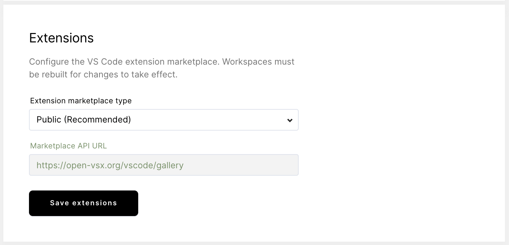

You can customize VS Code with extensions, which allow you to add new features
and functionality (e.g., languages, debuggers, tools), themes, and more.

## The extension marketplace

You can find the extensions available to you in the extension marketplace. Coder
enables access to the marketplace by default and requires no unique
configuration on your part. You can, however, choose between two types of
extensions marketplaces by going to **Manage** > **Admin** > **Infrastructure**,
then scrolling down to **Extensions**:

- **Public**: the
  [Open VSX public extension marketplace](https://github.com/eclipse/openvsx/wiki/Using-Open-VSX-in-VS-Code),
  which Coder uses by default
- **Custom**: your organization's custom VS Code extension marketplace API,
  accessed via the URL you provide

## Air-gapped marketplaces

If you run Coder in an air-gapped workspace, the public VS Code marketplace is
inaccessible to end-users. Using the **Custom** configuration option, you can
point Coder to an air-gapped instance of a marketplace.

Coder offers an open-source project
[code-marketplace](https://github.com/coder/code-marketplace) to serve
air-gapped VS Code extensions.

[OpenVSX](https://github.com/eclipse/openvsx) is another open-source project to
serve VS Code extensions.
