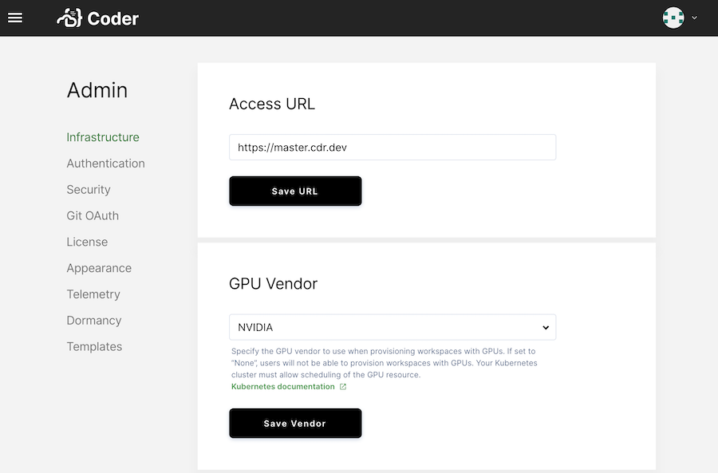

# GPU acceleration

Graphical processing units (GPUs) are useful with compute-intensive workloads,
such as those involved with data science/machine learning projects.

You can allocate GPUs to workspaces once a site manager configures and enables
this feature. Enabling GPU acceleration requires that you've configured your
Kubernetes cluster and
[scheduled GPUs](https://kubernetes.io/docs/tasks/manage-gpus/scheduling-gpus/).
For instructions on how to schedule GPUs with your specific cloud vendor, see:

- [Amazon Elastic Container Service](https://docs.aws.amazon.com/AmazonECS/latest/developerguide/ecs-gpu.html)
- [Azure Kubernetes Service](https://docs.microsoft.com/en-us/azure/aks/gpu-cluster)
- [Google Kubernetes Engine](https://cloud.google.com/kubernetes-engine/docs/how-to/gpus)

Once your Kubernetes cluster has been configured, you can enable GPUs in Coder.

To do so, go to **Manage** > **Admin**. On the **Infrastructure** tab, find the
**GPU Vendor** setting, and change it to the GPU vendor of choice (either
**AMD** or **Nvidia**). Click **Save Vendor**.

