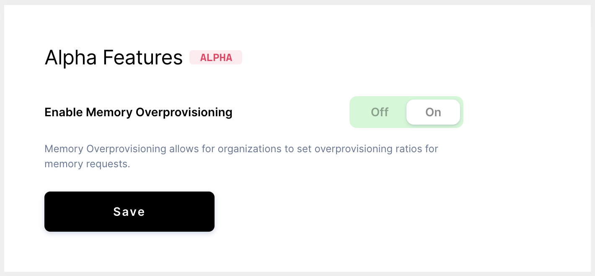

# Memory provisioning

Coder allows you to set memory provisioning ratios for each of your
organizations. By changing this ratio, you can change the number of workspaces
that fit onto a single Kubernetes node.

## Step 1: Enabling memory provisioning

A site admin/manager must complete these steps:

1. In the Coder Dashboard's top navigation bar, go to **Manage** > **Admin**.
1. Under the **Infrastructure** tab, check the box next to **Enable Memory
   Overprovisioning**.

## Step 2: Changing the memory provisioning rate

1. Go to **Manage** > **Organizations** and select your organization.
1. At the top of your organization page, click **Actions** > **Edit**. Scroll
   down to **Memory Provisioning Rate** and set the maximum ratio
1. Click **Update**.

