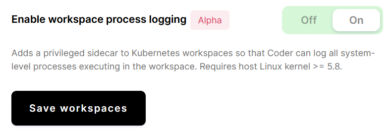

The workspace process logging feature allows you to log all system-level
processes executing in the workspace.

Enabling workspace process logging adds a sidecar to your workspaces that will
log all processes users start in the workspace (e.g., commands executed in the
terminal or system processes created by background services in CVM workspaces).
You can view the output from the sidecar or send it to a monitoring stack, such
as CloudWatch, for further analysis.

Please note that these logs are not recorded or captured by the Coder
organization in any way, shape, or form.

## How this works

Coder uses [eBPF][ebpf] (which we chose for its speed) to perform in-kernel
logging and filtering of all `exec` system calls to match events originating
from the workspace.

The core of this feature is also open source and can be found in the
[`exectrace` repo on GitHub] repo.

[`exectrace` repo on github]: https://github.com/coder/exectrace

## Requirements

Use of the workspace process logging functionality requires a host Linux
kernel >= 5.8.

## Enable workspace process logging

To enable workspace process logging:

1. Log into Coder as a site manager.
1. Go to **Manage** > **Admin**.
1. On the **Infrastructure** page, scroll down to the **Workspace container
   runtime** section.
1. Toggle on **Enable workspace command execution recording**.
1. Click **Save workspaces**.



This setting will apply to all new workspaces; it will apply to existing
workspaces only after they have been rebuilt.

## View logs

To view the process logs from a specific user or workspace, you can use your
cloud provider's log viewer, or you can use `kubectl` to print the logs:

```bash
kubectl logs \
  -l "com.coder.username=zac" \        # Filter by the user "zac"
  -l "com.coder.workspace.name=code" \ # Filter by the workspace "code"
  -c exectrace                         # Only show logs from the sidecar
```

### View logs in AWS EKS

If you're using AWS' Elastic Kubernetes Service, you can [configure your
cluster][eks-cloudwatch] to send logs to CloudWatch. This allows you to view the
logs for a specific user or workspace.

To view your logs, go to the CloudWatch dashboard (which is available on the
**Log Insights** tab) and run a query similar to the following:

```text
fields @timestamp, log_processed.fields.cmdline
| sort @timestamp asc
| filter kubernetes.container_name="exectrace"
| filter log_processed.fields.labels.username="zac"
| filter log_processed.fields.labels.workspace_name="code"
```

## Usage considerations

- This feature is only supported on Kubernetes workspaces. None of the other
  workspace types (such as those on [EC2][ec2-doc] or using [Coder for
  Docker][c4d-doc]) currently include process logging capabilities.
- With this feature enabled, all of the nodes on which Coder schedules
  workspaces run Linux kernel >= 5.8. If not, workspaces scheduled on
  incompatible nodes will fail to start correctly for security reasons.
- **Google Kubernetes Engine users**: At this time, GKE's stable branch runs
  Linux kernel 5.4; as such, this feature doesn't work on GKE (you may be able
  to leverage this feature if you opt for the rapid branch instead).
- **AWS Elastic Kubernetes Service users**: EKS kernels on the Ubuntu 20.04
  image family use the kernel version necessary for this feature (we have not
  tested other image families)
- The sidecar attached to each workspace is a [privileged][privileged] container
  (this is similar to the CVM container on CVM-enabled workspaces), so you may
  need to review your organization's security policies before enabling this
  feature. Enabling workspace process logging does _not_ grant extra privileges
  to the workspace container itself, however.
- Coder logs processes from nested Docker containers (including deeply nested
  containers) correctly, but Coder does not distinguish between processes
  started in the workspace and processes started in a child container in the
  logs.
- With CVM-enabled workspaces, this feature may detect and log startup processes
  begun in the outer container (including container initialization processes).
- Because this feature logs **all** processes in the workspace, high levels of
  usage (e.g., during a `make` run) will result in an abundance of output in the
  sidecar container. Depending on how your Kubernetes cluster is configured, you
  may incur extra charges from your cloud provider to store the additional logs.

[c4d-doc]: ../../setup/docker.md
[ebpf]: https://ebpf.io
[ec2-doc]: ../workspace-providers/deployment/ec2.md
[eks-cloudwatch]:
  https://docs.aws.amazon.com/AmazonCloudWatch/latest/monitoring/Container-Insights-EKS-logs.html
[privileged]:
  https://kubernetes.io/docs/concepts/policy/pod-security-policy/#privileged
