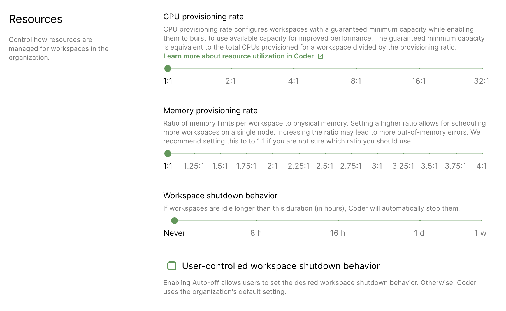

You can specify the duration of inactivity allowed before a workspace
automatically shuts down. This helps you optimize your resource allocation since
automatically shutting down idle workspaces can save resource availability and
reduce costs.

A workspace that's stopped must be rebuilt before it can be used again. All
data outside of **/home** is lost during rebuild. Please store any changes you
would like persisted across rebuilds with the
[Dotfiles](../../workspaces/personalization.md) feature.

> If Code Web (VS Code in a browser), the web terminal, or an SSH connection
> are open, Coder considers the workspace to be active and will not
> automatically shut down.

## Configuring workspace shutdown behavior

If you have administrative privileges, you can configure the workspace shutdown
behavior. Configuring the workspace shutdown behavior is done at the
organization level.

In the Coder dashboard, go to **Manage** > **Organizations** and choose the
organization you'd like to modify.

Click **Edit** in the top-right. In the dialog that opens, use the slider
underneath **Workspace Shutdown Behavior** to select the maximum allowed
duration.

Select **User-controlled workspace shutdown behavior** if you'd like to allow
users to set their desired shutdown behavior. This will override the org-level setting.

