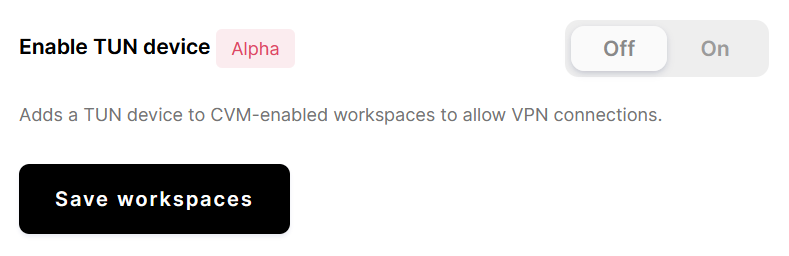

By default, Coder workspaces do not contain a TUN device, making it difficult to
run a VPN. However, Coder offers an admin configuration setting that, when
enabled, automatically creates a TUN device within all Kubernetes [CVM-enabled
workspaces](cvms/index.md).

> At this time, Coder does not support TUN devices for other workspace types
> (such as EC2 or Docker).
>
> If you're working with EC2 workspaces, we recommend enabling privileged mode
> in the workspace provider settings, which will allow users to create their own
> TUN device.

## Enable TUN devices in Coder

To enable TUN devices for Kubernetes [CVM-enabled workspaces](cvms/index.md):

1. Log into Coder, and go to **Manage** > **Admin**.
1. On the **Infrastructure** page, scroll down to the **Workspace container
   runtime** section.
1. Under **Enable TUN device**, click the toggle to switch this feature **On**.
1. Click **Save workspaces**.

> The new setting will apply to workspaces **after** you rebuild them.

Users running workspaces with TUN devices should be able to run VPN clients
within their workspace as long as they have root (or `sudo`) access within their
workspace.

> We've tested this feature using the [Tailscale](https://tailscale.com/) VPN
> within Coder.
