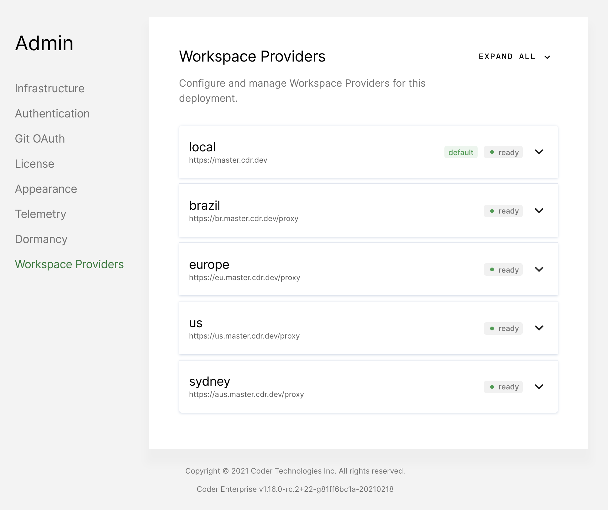

This article walks you through the process of deploying a workspace provider to
a [Kubernetes cluster](../../setup/kubernetes/index.md).

[Workspace Providers](index.md)
are logical groups of resources to which developers can deploy workspaces. Like
the Coder deployment, workspace providers are deployed via a helm chart to the
Kubernetes cluster where you'd like to provision new workspaces.

## Dependencies

Install the following dependencies if you haven't already:

- [Coder CLI](../../cli/installation.md)
- [helm](https://helm.sh/docs/intro/install/)
- [kubectl](https://kubernetes.io/docs/tasks/tools/install-kubectl/)

## Requirements

1. Workspace providers **must have a hostname set** that is a subdomain of the
   Coder deployment. For example, if the Coder deployment's hostname is
   `coder.example.com`, the workspace provider's hostname must match the format
   `*.coder.example.com`.
2. The main Coder deployment and the workspace provider must be able to
   communicate bi-directionally via their respective hostnames.
3. The Kubernetes cluster address must be reachable from the Coder deployment.

## Connecting to the Cluster

To add a Kubernetes cluster as a workspace provider, you must first make sure
that you're connected to the cluster you want to expand into

```bash
kubectl config current-context
```

Confirm that your current kubectl context correct before continuing; otherwise,
connect to the correct context.

## Creating the Coder Namespace (Optional)

We recommend running workspace providers in a separate
[namespace](https://kubernetes.io/docs/concepts/overview/working-with-objects/namespaces/);
to do so, run

```bash
kubectl create namespace coder
```

Next, change the kubectl context to point to your newly created namespace:

```bash
kubectl config set-context --current --namespace=coder
```

## Creating the New Workspace Provider

Using the Coder CLI, create a new workspace provider in the `pending` state.

```bash
coder providers create [NAME] \
    --hostname=[HOSTNAME] \
    --clusterAddress=[CLUSTER_ADDRESS]
```

You must provide the following arguments:

- `name`: A unique name of the workspace provider
- `hostname`: Hostname of the workspace provider
- `clusterAddress`: The address of the Kubernetes cluster apiserver. This can be
  retrieved using

  ```bash
  kubectl config view -o jsonpath='{.clusters[?(@.name == "'"$(kubectl config current-context)"'")].cluster.server}{"\n"}'
  ```

The `coder providers create` command will generate a helm command you will use
for the next steps, so make sure to save the output.

The returned `REMOTE_ENVPROXY_TOKEN` is a shared secret between the two
deployments and is what the workspace provider will use to authenticate itself
when communicating with the Coder deployment.

## Installing Workspace Provider

1. If you haven't already, add the Coder helm repo

   ```bash
   helm repo add coder https://helm.coder.com
   ```

1. Install the helm chart onto your cluster using helm command you generated in
   the previous step where you created the workspace provider. The helm command
   will follow this pattern:

   ```bash
   helm upgrade coder-workspace-provider coder/workspace-provider \
      --version=[CODER_VERSION] \
      --atomic \
      --install \
      --force \
      --set envproxy.token=[REMOTE_ENVPROXY_TOKEN] \
      --set ingress.host=[HOSTNAME] \
      --set envproxy.clusterAddress=[CLUSTER_ADDRESS] \
      --set cemanager.AccessURL=[CEMANAGER_ACCESS_URL]
   ```

   Optionally, you can provide additional helm configuration values by providing
   a `values.yaml` file and adding the argument `-f my-values.yaml` to the
   generated command. Helm values control attributes of the workspace provider,
   including DevURLs, Kubernetes storage classes, SSH, and more. See the
   [Workspace Provider Helm Chart
   Values]("https://github.com/cdr/enterprise-helm/blob/workspace-providers-envproxy-only/README.md")
   for more details.

   If you're unfamiliar with the helm configuration values file, see our doc on
   [updating a helm chart](../../guides/helm-charts.md)

2. Once the Helm chart has deployed successfully, you should see the workspace
   provider in a `ready` state on the Workspace Provider Admin page.

   

3. From the Workspace Provider Admin page, add the desired organizations to its
   allowlist.

Users in the allowed organizations can now choose to deploy into the newly setup
   workspace provider.

## Upgrading the Workspace Provider

We strongly recommend that you upgrade your workspace providers in lockstep with
your Coder deployment.

You only need to update the `--version` flag if you want to make no other helm
values changes; you can do this with

```bash
helm upgrade coder-workspace-provider coder/workspace-provider \
    --version=[CODER_VERSION] \
    --atomic \
    --install \
    --force
```

If you want to update any of the helm chart's values, you can do so by supplying
a values file (`-f myvalues.yaml`) or using with the `--set` flag. Any existing
values that were set during installation will persist unless you explicitly
write over them.

## Deleting a Workspace Provider

You can only remove a workspace provider if it no longer contains any
workspaces, so you must remove all workspaces before deleting the workspace
provider.

To remove a workspace provider, run the following command using the Coder CLI:

```bash
coder providers rm [NAME]
```
