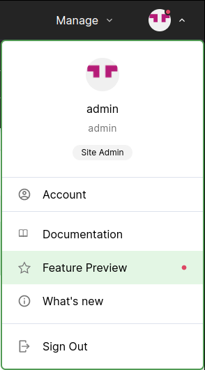
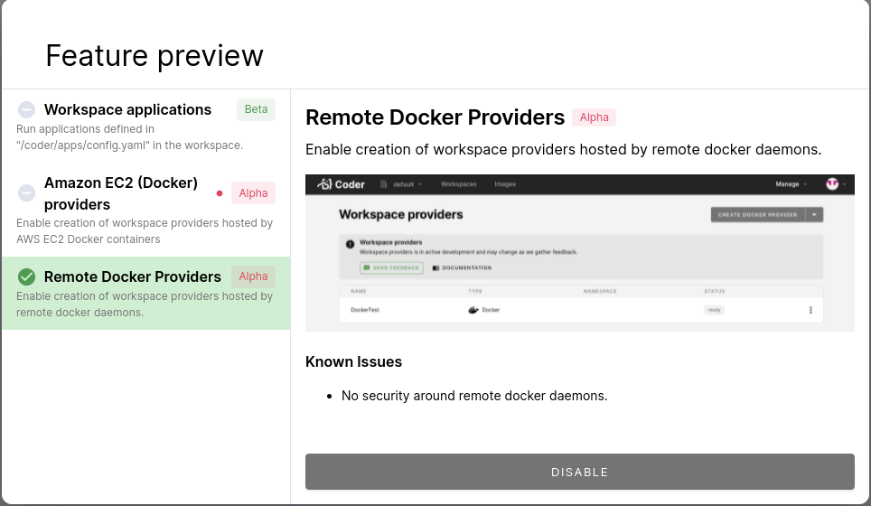
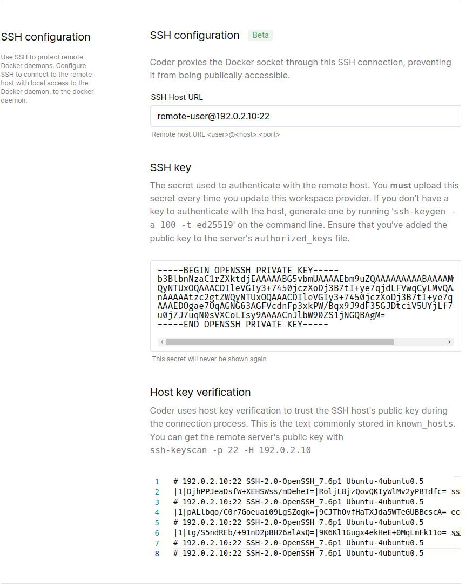

# Docker

> This Workspace Provider type is no longer supported in Coder v1. Please use
> [Coder v2](https://coder.com/docs/coder-oss/latest) to use a remote VM as a
> workspace provisioner.

This article walks you through the process of deploying a workspace provider to
a remote VM instance using Docker.

## Prerequisites

- You must have a provisioned VM with the Docker Engine installed and running.
  The Docker Engine must be at least version [20.10][docker-engine-version].

- Coder must be able to access the VM over an SSH connection.

- The Coder deployment must be accessible from the containers deployed inside
  the VM.

## 1. Create a new SSH key

Coder uses SSH to connect to the remote VM and communicate with the Docker
Engine.

We recommend that you create a new SSH key for this purpose and do _not_ reuse
this key. Furthermore, ensure that you save this key, since you'll need it to
edit your workspace provider in the future.

> &#10071; Coder does not currently support password-protected SSH keys; the SSH
> key must be unencrypted.

To generate your SSH key, run:

```console
ssh-keygen -t ed25519 -C remote-c4d -f $HOME/.ssh/remote_c4d -N ""
```

## 2. Add the SSH key to the remote VM

Add your SSH key to the remote VM's `authorized_keys` file; this will allow
Coder to connect via SSH using the new `remote_c4d` key:

```console
# Replace 'remote-user@192.0.2.10' with your VM's user and host/ip.
ssh-copy-id -f -i $HOME/.ssh/remote_c4d.pub remote-user@192.0.2.10
```

## 3. Verify the SSH key

Verify that you can use the key to connect via SSH to your remote VM:

```console
# Replace 'remote-user@192.0.2.10' with your VM's user and host/ip.
ssh remote-user@192.0.2.10 -o IdentitiesOnly=yes -i $HOME/.ssh/remote_c4d 'echo All good!'
```

## 4. Enable the Docker providers feature flag

In your Coder for Docker deployment, ensure that you've enabled the **Remote
Docker Providers** feature flag.

1. Log in to Coder, and go to **Account** > **Feature Preview**

   

1. Click to enable **Remote Docker Providers**

   

## 5. Create the workspace provider

To create your workspace provider, go to **Manage** > **Workspace providers**.
Click the dropdown in the top-right corner to launch **Create Docker Provider**


You can now fill out the provider form.

1. Provide a **name** for your new provider.

1. For the **Docker Daemon URL**, use `unix:///var/run./docker.sock`

1. Under the **SSH configuration** section:

   1. Under **SSH Host URL**, provide the SSH URL for the remote VM, **including
      the port** (e.g., `remote-user@192.0.2.10:22`)
   1. Copy over the private key that you created earlier (you can retrieve it
      with `cat $HOME/.ssh/remote_c4d`)
   1. Run the keyscan provided for known host verification, and copy over the
      output:

      ```console
      # Example:
      ssh-keyscan -p 22 -H 192.0.2.10
      ```

   1. Optionally, set the access URL to an IP address or URL that workspaces can
      use to access `coderd`. You do not need this override if the site-wide
      access URL is accessible from the workspace container.

   

[docker-engine-version]: https://docs.docker.com/engine/release-notes/#20100
