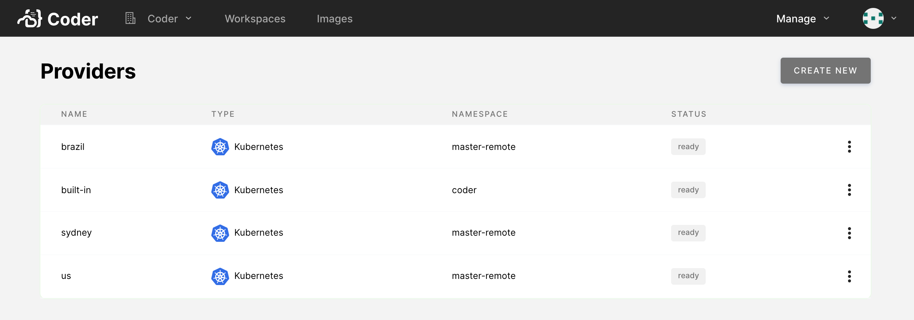
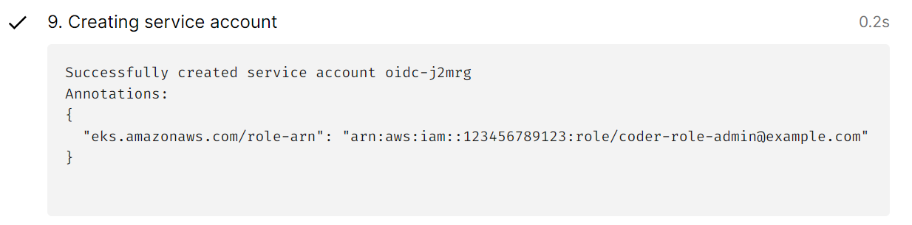

This article walks you through the process of managing your workspace provider
via the Coder UI.

## Admin UI

Site admins and site managers can view the workspace providers configuration
page available via **Manage** > **Workspace Providers**.



The Admin panel shows an overview of all configured workspace providers and
indicates their statuses and details.

## Statuses

A workspace provider can have one of the following statuses:

- **Pending**: The workspace provider has been registered but not deployed to
  the remote Kubernetes cluster.
- **Ready**: The workspace provider is online and available, and you can
  provision new workspaces to it.
- **Error**: The workspace provider encountered an issue on startup or cannot be
  reached by the Coder deployment. The workspace provider's details will include
  an error message.

## Edit a workspace provider

To edit a workspace provider, log in to Coder, and go to **Manage** >
**Providers**.

In the **Providers** list, find the workspace provider you want to edit. Click
the vertical ellipsis to its right, and select **Edit**.

At this point, you can:

- Change the **name of the provider**.

- Select the **organizations** that can use this provider; if you do not select
  at least one organization, no one will be able to provision workspaces using
  this provider.

  > Organizations must not contain any workspaces in the workspace provider
  > before you remove them from a workspace provider's allowlist.

- Change the features of the workspace provider. You can:

  - Enable **end-to-end encryption** for this provider
  - Enable **external SSH connections** to the provider's workspaces via the
    Coder CLI
  - Specify a **Kubernetes storage class** to use when Coder provisions
    workspaces (this is useful for improving disk performance)
  - Specify the **Kubernetes service account** that Coder uses to provision
    workspaces

  > If you enable **end-to-end encryption**, end-users using SSH need to rerun
  > `coder config-ssh`.

- Specify the Kubernetes `pod_tolerations`, `pod_node_selector`,
  `service_account_annotations`, and `affinity` for the workspaces deployed with
  this provider:

  ```json
  {
    "pod_tolerations": [
      {
        "key": "com.coder.workspace",
        "operator": "Exists",
        "effect": "NoSchedule"
      }
    ],
    "pod_node_selector": {},
    "service_account_annotations": {},
    "affinity": {}
  }
  ```

  Configuring ServiceAccount Annotations allows you to create Kubernetes
  service accounts for each workspace and attach custom annotations to
  the ServiceAccount. This is commonly used to integrate OIDc authentication
  into the workspace pods. The Annotations can use `{{ .UserEmail }}` to render
  the workspace user's email:

    ```json
  {
    "service_account_annotations": {
      "eks.amazonaws.com/role-arn": "arn:aws:iam::123456789123:role/coder-role-{{.UserEmail}}"
    },
  }
  ```

  Once set, you will see a workspace build set where a service account is 
  created and the user email is populated properly.

  

  Configuring affinities allows you to control how workspaces are scheduled
  across nodes. By default, Coder sets a default pod affinity that favors
  scheduling pods on Nodes that have other workspaces running to optimize
  for cost savings. The default affinity is the following:

  ```json
  "affinity": {
        "podAffinity": {
            "preferredDuringSchedulingIgnoredDuringExecution": [
                {
                    "weight": 1,
                    "podAffinityTerm": {
                        "labelSelector": {
                            "matchLabels": {
                                "com.coder.resource": "true"
                            }
                        },
                        "topologyKey": "kubernetes.io/hostname"
                    }
                }
            ]
        }
    }
  ```

  For Kubernetes clusters with Nodes spread across multiple availability zones
  it may not be favorable to use the default `affinity`. Due to persistent disks
  often being zonal it can cause pods to become saturated in a single zone and
  cause pods to become unschedulable. You can unset this affinity by setting it 
  to an empty object and allow the default behavior of the Kubernetes scheduler.
  ```json
    "affinity": {}
  ```

Once you've made your changes, click **Update Provider** to save and continue.

## Delete a workspace provider

1. Log in to Coder, and go to **Manage** > **Providers**.

1. In the **Providers** list, find the workspace provider you want to delete.
   Click the vertical ellipsis to its right. Select **Delete**.

1. Confirm that you want to delete the provider; once deleted, no user will be
   able to provision workspaces using that provider.

> You can only remove a workspace provider if it no longer contains any
> workspaces, so you must remove all workspaces before deleting the workspace
> provider.
