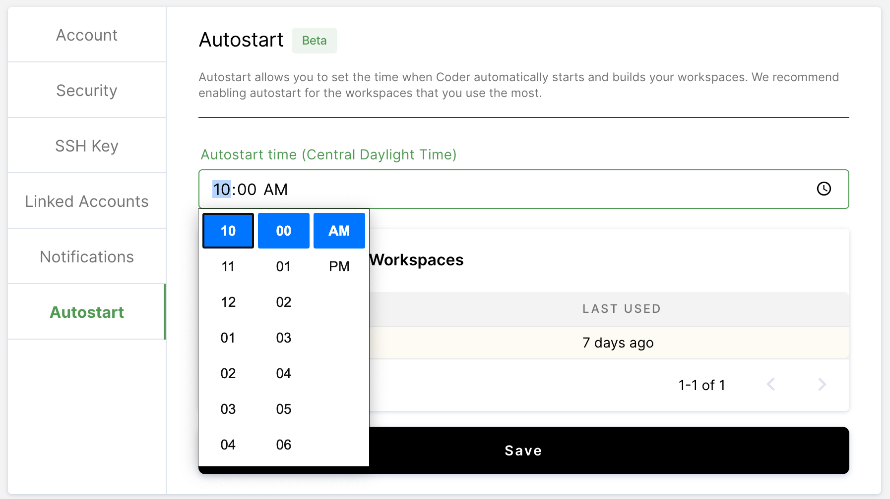
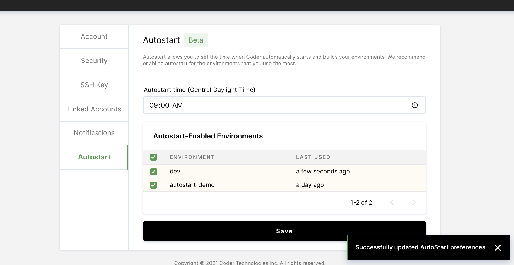

Coder automatically turns off any environments you're not using after 8
hours. This helps customer's save on cloud costs. Unfortunately,
this required users to manually start their environments at the
beginning of each work day.

# Autostart

Autostart allows each individual developer on the team to configure automated
environment rebuilds at a time that best suits their workflow. Users can now
expect their environments to be ready for them at the start of each workday.

As a result, users save time and can expect their environment to always be on
the latest image at the start of each workday.

# Configuration

To configure autostart for your environments:

- 1 Navigate to your account settings by clicking on your avatar in
the upper-right hand corner of your screen and then clicking `account`
in the drop-down menu.

- 2 Click on the autostart tab and select an autostart time using the drop-down menu.

- 3 Finally, select which environments should be autostarted and save your preferences.

## Constraints

In order for your environment to be successfully autostarted, it must
satisfy the following eligibility criteria.

- 1 You have configured autostart for the environment in question using the configuration steps above.

- 2 Your environment is off when it's time for autostart. We don't wan't to trigger a rebuild if you're already working.

- 2 Your environment must be active. An inactive environment is defined as an environment that has not been opened in 5 days or more.

## Caveat

An automated environment rebuild may be triggered up to 5 minutes before your autostart time if all of the above eligibility requirements are satisfied. The purpose of this is to have your environment ready for you by your autostart time.