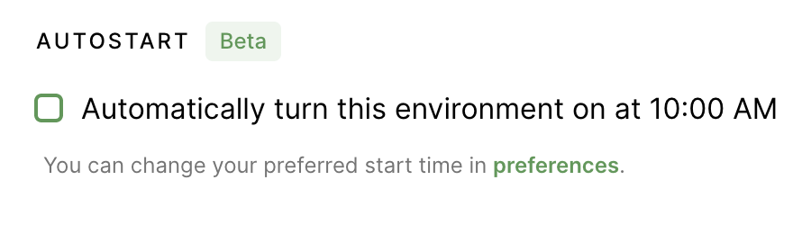

Coder [automatically turns off idle
environments](../admin/environment-management/shutdown.md) to help manage
resource expenditure. Typically, this means environments turn off overnight and
remain offline until a rebuild is requested. With Autostart, rebuilds may be
automatically requested at a time that best suits your workflow. You can expect
your environments to be ready for you at the start of each work day.

## Criteria for Autostart

Your environment must meet the following criteria for you to use Autostart:

1. You've [set the Autostart time and selected
   environments](#enabling-autostart) to be started automatically at that time.

1. Your environments are off at the Autostart time (Autostart won't work if your
   environments are on to prevent the possibility of triggering a rebuild while
   you're working).

1. Your environment must be active. We define *inactive* environments as those
   that haven't been opened within the last five days.

> Coder may trigger Autostart up to five minutes before your scheduled time to ensure
all queued environments are ready by their scheduled time.

## Enabling Autostart

1. Click on your avatar in the top-right and select **Account** in the drop-down
   menu.

2. Select the **Autostart** tab and set your desired Autostart time.

    

3. Select the environments for which you want to enable Autostart and save.

    

### Enabling Autostart for New Environments

When creating a new environment, you set it to Autostart at your existing
Autostart time by checking the box labeled **Automatically turn this environment
on at (HH:mm)** (HH:mm will display the time you've set). Doing so saves you from
returning to User Preferences at this point.

