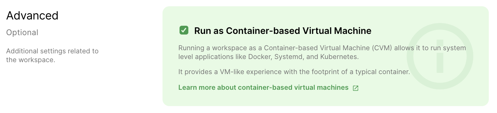

Standard Coder Environments run as normal Docker containers. This carries
limitations as to what applications you can run inside your Environment. Most
notably, it's not possible to run Docker securely within normal Docker
containers.

Coder offers an alternative Environment deployment option that allows you to run
Docker, Docker Compose, systemd, and other system-level applications securely
within your development containers. We call this environment variant a
_Container-based Virtual Machine (CVM)_.

> Are you a platform admin? Learn how to
> [enable Docker in Environments](../admin/environment-management/cvms.md) for
> your deployment.

## Container-based Virtual Machine (CVM)

By choosing this option, your Environment behaves like a VM or raw host, yet
retains the image, security, and performance properties of typical containers.

To create an Environment capable of securely running system-level applications
like Docker, check the `Run as Container-based Virtual Machine` box when you
create a new Environment.

## Disk

Standard environments only persist the `/home` directory in your Environment
disk. CVM Environments have additional levels of persistence:

1. `/var/lib/docker` is stored in your Environment disk and is persisted between
   rebuilds. This prevents shutdowns and rebuilds from purging the Docker cache.

1. The Environment Image is itself stored in your Environment disk. Note that
   this data is never directly accessible to you but will still consume data on
   your disk and count towards the size limit.

When setting default disk sizes for [Images](../images/index.md), plan for these
additional storage requirements. We recommend treating the environment as a full
machine, so disk sizes in the range of 50-100 GB are reasonable. This is
especially true if users of the image are storing large Docker caches.
