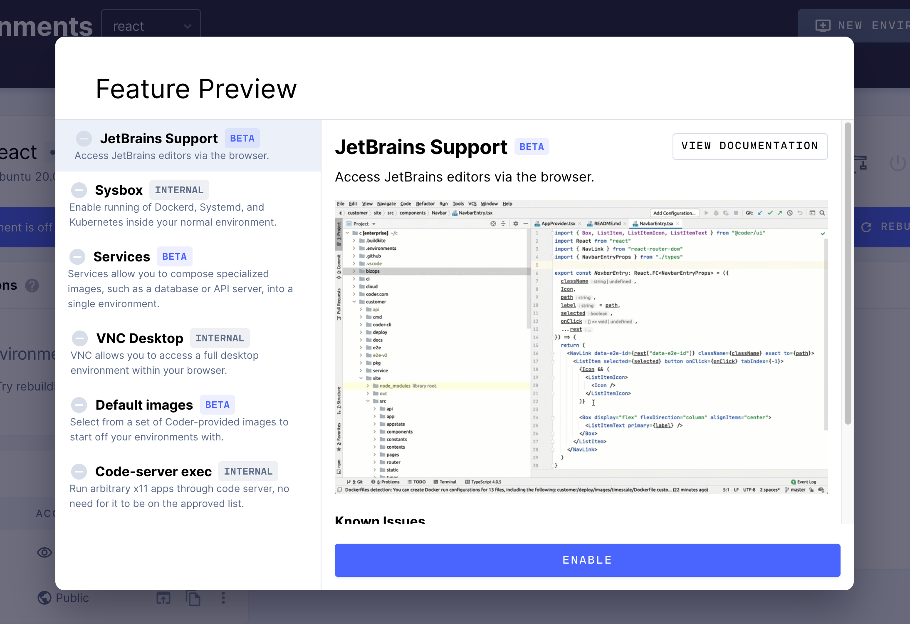

There are four primary ways you can connect an IDE to your Coder Environment:
1. [VSCode Remote SSH](#vscode-remote-ssh) with local VSCode
1. [VSCode in the browser](#vscode-in-the-browser) with code-server
1. [JetBrains in the browser](#jetbrains-in-the-browser) with JetBrains Projector
1. *Any* local editor with [2-way file synchronization over SSH](https://help.coder.com/hc/en-us/articles/360058001313?__hstc=103542367.6151dcd6d50b6cb62a878734c4aad255.1608274456028.1608306470901.1608410536657.3&__hssc=103542367.75.1608410536657&__hsfp=974138608)

## VSCode Remote SSH

Once you've [set up SSH access to Coder Enterprise](./ssh.md), you can work on projects
from your local VSCode, connected to your Coder Environment for compute,
etc.

1. Open VS Code locally.
2. Make sure that you've installed [Remote -
   SSH](https://marketplace.visualstudio.com/items?itemName=ms-vscode-remote.remote-ssh) extension
3. In VS Code's left-hand nav bar, click **Remote Explorer** and right click on an environment to connect

## VSCode in the browser

Launch VSCode in the browser from the Environments page by clicking the *Code* icon.

## JetBrains in the browser

Click your avatar to open a menu. Select **Feature Preview** to open the feature
preview modal where you can enable JetBrains support.

Coder Enterprise launches remote IDEs in their own windows; be sure to set your
browser to allow pop-up windows so that you can use your IDE.

> If you need a valid license to run your IDE locally, you'll also need one to
> run it in Coder.

### Known Issues

- Window dragging behavior can misalign with mouse movements
- Popover dialogs do not always appear in the correct location
- Popup windows are missing titles and window controls
- Some theme-based plugins can cause the IDE to render incorrectly
- Some minor rendering artifacts occur during regular usage
