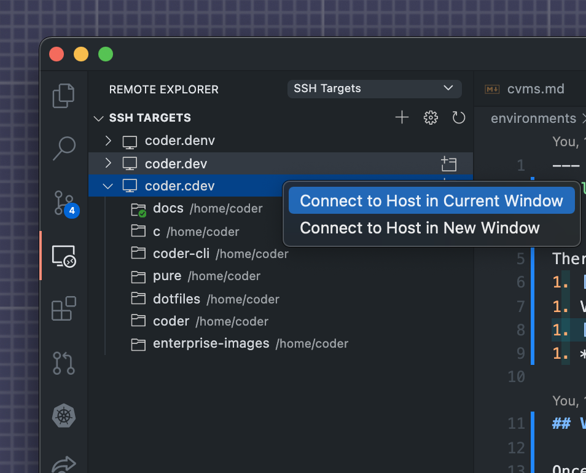
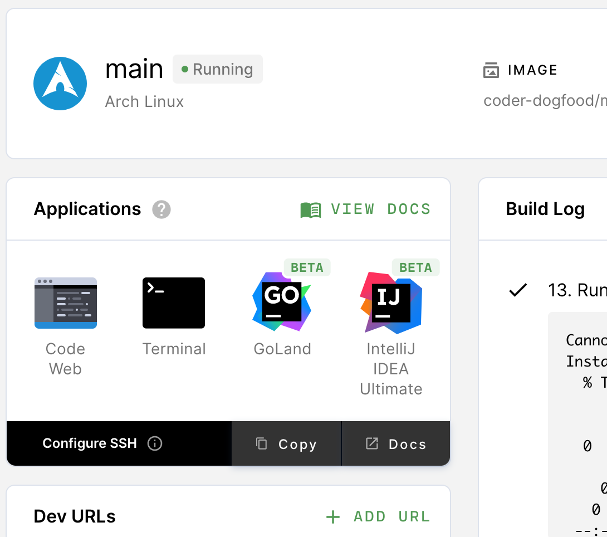
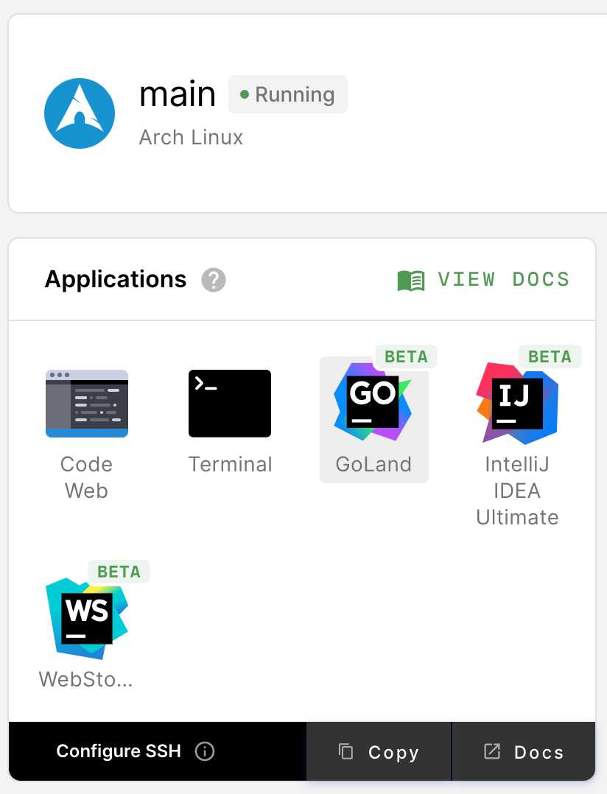

There are four primary ways you can connect an IDE to your Coder environment:

1. [VS Code Remote SSH](#vs-code-remote-ssh) with local VS Code
1. [VS Code in the browser](#vs-code-in-the-browser) with code-server
1. [JetBrains in the browser](##jetbrains-ides-in-the-browser) with JetBrains
   Projector
1. _Any_ local editor with [1-way file
   synchronization](../cli/file-sync.md#one-way-file-sync) or [2-way file
   synchronization over SSH](../cli/file-sync.md#two-way-file-sync)

## VS Code Remote SSH

Once you've [set up SSH access to Coder](./ssh.md), you can work on projects
from your local VS Code, connected to your Coder environment for compute, etc.

1. Open VS Code locally.
1. Make sure that you've installed [Remote -
   SSH](https://marketplace.visualstudio.com/items?itemName=ms-vscode-remote.remote-ssh)
   extension
1. In VS Code's left-hand nav bar, click **Remote Explorer** and right-click on
   an environment to connect

## VS Code in the Browser

Launch VS Code in the browser from the Environments page by clicking the _Code
Web_ icon.

## JetBrains IDEs in the Browser

If your image includes a JetBrains IDE, you can launch it from the dashboard.
Coder launches JetBrains IDEs in their own windows; be sure to set your browser
to allow popup windows so that you can use your IDE.

> If you need a valid license to run your IDE locally, you'll also need one to
> run it in Coder.

### Manually Installing JetBrains' IDEs

You can also manually install JetBrains' IDEs. After following JetBrains' steps
for installing your IDE (make sure that you install the IDE to your home
directory), create a symlink, and add it to $PATH.

The symlink names supported by Coder are:

- `clion`
- `datagrip`
- `goland`
- `intellij-idea-ultimate`
- `intellij-idea-community`
- `phpstorm`
- `pycharm`
- `pycharm-community`
- `rider`
- `rubymine`
- `webstorm`

### System Requirements

For the best possible experience, we recommend running the editor in an
environment with the following resources at a minimum:

- 8 GB RAM
- 4 CPU cores

### Known Issues

- Window dragging behavior can misalign with mouse movements
- Popover dialogs do not always appear in the correct location
- Popup windows are missing titles and window controls
- Some theme-based plugins can cause the IDE to render incorrectly
- Some minor rendering artifacts occur during regular usage
