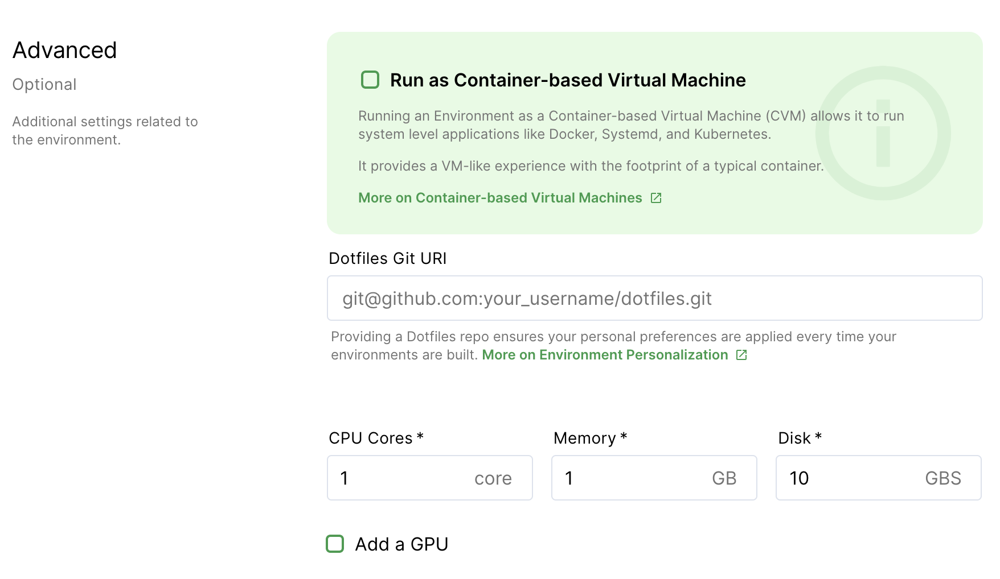

Whenever you log into Coder, you'll see the **Environments** page.

If this is your first time using Coder, you'll see a **Create Environment**
button in the middle of your screen; otherwise, you'll see a list of your
existing environments.

To create an environment, launch the creation dialog by:

- Clicking **Create Environment** (if available), or
- Clicking **New Environment** in the top-right

When prompted, provide the following information:

<table>
    <tr>
        <td><b>Environment Name</b></td>
        <td>A friendly name for your environment</td>
    </tr>
    <tr>
        <td><b>Image Source</b></td>
        <td>The source of your image; leave as <b>Existing</b> in most cases.
        You can also <b>import</b> a new image if your site manager has imported
            a <a href="../admin/registries/index.md">registry</a> or select a <b><a
            href="https://github.com/cdr/enterprise-images">packaged</
            a></b> image provided by Coder if your site manager has
            enabled the automatic importing of the <a
            href="../admin/registries/default-registry.md">Default Registry</a>.
        </td>
    </tr>
    <tr>
        <td><b>Image</b></td>
        <td>The Docker image you want to use as the base for your environment</td>
    </tr>
    <tr>
        <td><b>Tag</b></td>
        <td>The version of the Image you want to use</td>
    </tr>
    <tr>
        <td><b>Autostart</b></td>
        <td>Whether you want your environment to automatically start and build at
        the specified time</td>
    </tr>
    <tr>
        <td><b>Workspace Provider (Beta)</b></td>
        <td>A workspace provider is an additional Kubernetes cluster for Coder;
        choose the location that's closest to you to minimize latency </td>
    </tr>
        <tr>
        <td><b>Namespace</b></td>
        <td>The specific namespace where you want your environment deployed</td>
    </tr>
</table>

Coder offers several **advanced** settings that allow you to customize your
environment. You can choose to run your environment as a container-based virtual
machine, provide a dotfiles URI for [personalization](personalization.md),
and set your resource allocation.

<table>
    <tr>
        <td><b>Run as Container-based Virtual Machine</b></td>
        <td>Enable this to allow the running of system-level applications like
        Docker, Systemd, and Kubernetes; this provides a VM-like experience with
        the footprint of a container</td>
    </tr>
    <tr>
        <td><b>Dotfiles Git URI</b></td>
        <td>The link to your Dotfiles repo; Coder will apply the settings
        prescribed every time your environment rebuilds</td>
    </tr>
    <tr>
        <td><b>CPU Cores</b></td>
        <td>The number of CPU cores you'd like for your environment</td>
    </tr>
    <tr>
        <td><b>Memory</b></td>
        <td>The amount of memory you'd like for your environment</td>
    </tr>
    <tr>
        <td><b>Disk</b></td>
        <td>The amount of storage space you'd like for your environment</td>
    </tr>
    <tr>
        <td><b>Add a GPU</b></td>
        <td>Whether you want a
        [GPU](../admin/environment-management/gpu-acceleration.md) added to
        your environment</td>
    </tr>
</table>

> By default, Coder allocates resources (CPU Cores, Memory, and Disk Space)
> based on the parent image.
>
> Coder displays a warning if you choose your resource settings and they're less
> than the image-recommended default, but you can still create the environment.

When done, click **Create** to proceed. Coder redirects you to an overview page
for your environment during the build process.

## .gitconfig files

If the image you're using to create your environment doesn't include a
.gitconfig file, Coder will generate one for you automatically using the
details found in your Coder account.

You can modify the .gitconfig file, but we recommend using a
[personalization](personalization.md) file to customize your environment.
