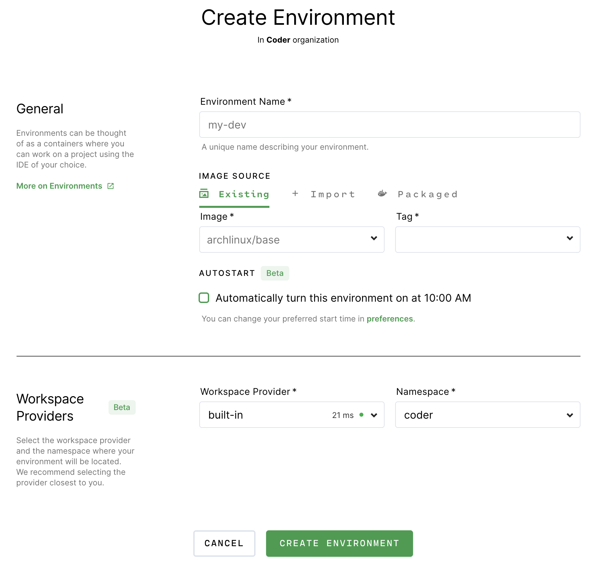
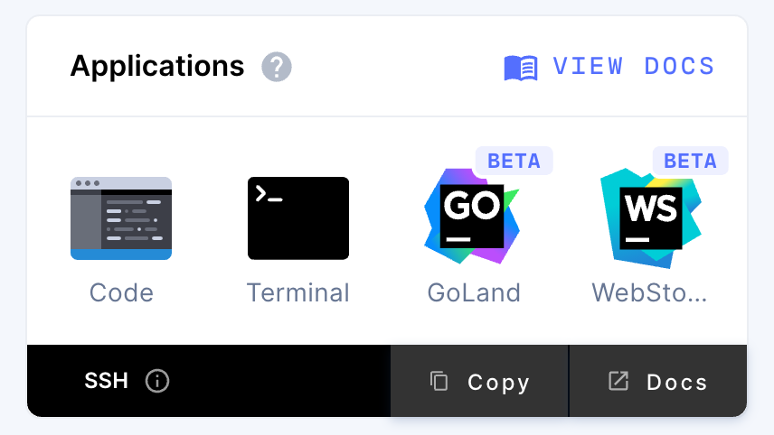

## 1. Import an image

Ensure you've [imported an image](../images/importing.md) for your
[environment](index.md) to use.

## 2. Create an environment

If this is your first time using Coder, you'll see a **Create Environment**
button in the middle of your screen; otherwise, you'll see a list of your
existing environments. Click the **New Environment** button.

1. Enter a friendly name for your environment, and choose an
   [image](../images/index.md) to use.

1. Set the [parameters](environment-params.md) for your environment.

1. Click **Create** to proceed.

Coder redirects you to an overview page for your environment during the build
process. Learn more about the environment
[creation parameters](./environment-params.md).

Your environment persists in the home directory, updates to new versions of the
image, and runs custom configuration on startup. Learn about the
[environment lifecycle](lifecycle.md).

### Advanced

Coder provides advanced settings that allow you to customize your environment.
You can choose to run your environment as a
[Container-based virtual machine](cvms.md), specifying the resources Coder
should allocate.

> By default, Coder allocates resources (CPU Cores, Memory, and Disk Space)
> based on the parent image.
>
> Coder displays a warning if you choose your resource settings and they're less
> than the image-recommended default, but you can still create the environment.

## 3. Start Coding

Once you've created an environment, it's time to hop in. Read more about how to
[connect your favorite editor or IDE](./editors.md) with your new environment!

> [Integrate with Git](./personalization#git-integration) to have your SSH key
> injected automatically into Environments.
